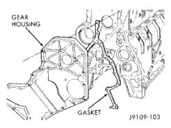
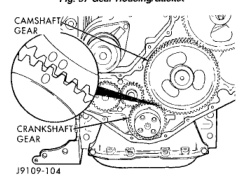

# 9-184 5.9L DIESEL ENGINE

## REMOVAL AND INSTALLATION (Continued)

(4) Install the seal into the rear of the cover using a plastic hammer and the alignment/installation tool provided in the seal kit to prevent damage to the seal carrier, hit the alignment/installation tool alternately at the 12, 3, 6 and 9 o'clock positions.

(5) Install the pilot from the seal kit onto the crankshaft.

(6) Using the pilot as an alignment tool, install the cover and a new gasket.

(7) Install the cover bolts and tighten to 24 N·m (18 ft. lbs.) torque. Remove pilot tool.

(8) Install the oil fill tube and mounting bolts. Tighten the bolts to 43 N·m (32 ft. lbs.) torque.

(9) Install the vibration damper. DO NOT tighten the bolts to the correct torque value at this time.

(10) Install the belt tensioner. Tighten the mounting bolts to 43 N·m (32 ft. lbs.) torque.

(11) Raise the belt tensioner to install the belt.

(12) Tighten the vibration damper bolts to 125 N·m (92 ft. lbs.) torque. Use an engine barring tool to keep the engine from rotating during tightening operation.

(13) Install the fan drive assembly.

### GEAR HOUSING

#### REMOVAL

(1) Remove the engine assembly from the vehicle.

(2) Remove the front end components and the gear housing cover (refer to Gear Housing Cover Removal for the proper procedures).

(3) Remove the following:
- Camshaft
- Gear driven accessories
- Fuel injection pump (refer to Group 14, Fuel System)
- Fan hub assembly (refer to Group 7, Cooling System)

(4) Remove the gear housing and gasket (Fig. 57).

(5) Clean the gasket material from the cylinder block.

*Fig. 57 Gear Housing/Gasket]*
- GEAR HOUSING
- GASKET

*Fig. 58 Camshaft/Crankshaft Gear Alignment]*
- CAMSHAFT GEAR
- CRANKSHAFT GEAR

#### INSTALLATION

(1) Install a new gasket and the gear housing. Tighten the bolts to 24 N·m (18 ft. lbs.) torque.

(2) Install the camshaft. Make sure the alignment marks on the camshaft and crankshaft gears are aligned (Fig. 58).

(3) If a new housing is installed, the timing pin assembly must be accurately located.

(4) Install the following:
- Fan hub assembly (refer to Group 7, Cooling System)
- Fuel injection pump (refer to Group 14, Fuel System)
- Gear driven accessories

(5) Install the gear housing cover (refer to Gear Housing Cover Installation for the proper procedures).

(6) Install the front end components.

(7) Install the engine assembly into the vehicle.

### TIMING PIN

The timing pin can be replaced without removing the assembly from the gear housing.

#### REMOVAL

(1) Remove the timing pin by prying the retaining ring out with a small screwdriver. Replace the retaining ring if it is damaged during removal.

#### INSTALLATION

(1) If timing pin assembly is removed from gear housing, it must be precisely reset to obtain exact TIDC.

(2) Install a new O-Ring, lubricate the pin and position in the housing (Fig. 59). Install the new retaining ring to 1.5 mm (0.059 inch).