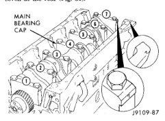

# 9-192 5.9L DIESEL ENGINE

## REMOVAL AND INSTALLATION (Continued)

crankshaft does not rotate freely, check the installation of the rod bearing and the bearing size.

(12) Measure the side clearance between the connecting rod and the crankshaft (Fig. 80). DO NOT measure the clearance between the cap and crankshaft.

*Fig. 80 Side Clearance between Connecting Rod/Crankshaft*

| SIDE CLEARANCE LIMITS |
| --- |
| MIN. 0.100 mm (0.004 inch) |
| MAX. 0.300 mm (0.012 inch) |

(13) Install the suction tube and oil pan.

(14) Install the cylinder head onto the block.

(15) Install the engine assembly into the vehicle.

## CRANKSHAFT

### REMOVAL

(1) Remove the rear crankshaft seal housing.

(2) Remove the gear housing.

(3) Rotate the engine to a horizontal position and remove the main bearing bolts.

(4) The main bearing caps should be numbered. If they are not, be sure to mark them, beginning with number one at the front and ending with number seven at the rear (Fig. 81).

*Fig. 81 Numbering Main Bearing Caps*

CAUTION: DO NOT pry on the main caps to free them from the cylinder block.

(5) Use two of the main bearing cap bolts to wiggle the main cap loose, being careful not to damage the bolt threads (Fig. 82). Remove the caps.

*Fig. 82 Main Bearing Cap Removal]*

WARNING: USE A HOIST TO AVOID INJURY.

(6) Lift the crankshaft and gear from the cylinder block (Fig. 83).

[Figure: Fig. 83 Lifting Crankshaft out of Cylinder Block
- CRANKSHAFT]

(7) Remove the main bearings from the block and the main caps.

(8) Remove the piston cooling nozzles by using a 3/16 inch pin punch to push them out (Fig. 84).

### INSTALLATION

CAUTION: Use only hand force to push the nozzle in place. If driven with a hammer, the nozzle will be damaged.