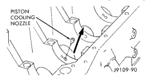
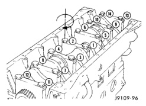
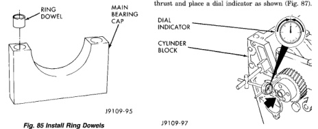

# 5.9L DIESEL ENGINE 9-193

## REMOVAL AND INSTALLATION (Continued)

*Fig. 85 Piston Cooling Nozzles - showing piston cooling nozzle installation]*

(1) Use a center punch to push the piston cooling nozzle into place. Install nozzles so they are even with or slightly below the saddle surface.
(2) Make sure the saddle surface is clean and dry. Install the upper main bearings.
(3) Install the combination thrust/main bearing in the number six main bearing location.
(4) Lubricate the bearings with Lubriplate 105, or equivalent.

**WARNING: TO AVOID INJURY, USE A HOIST TO INSTALL THE CRANKSHAFT.**

(5) Install the crankshaft.

**CAUTION: Crankshaft must be lowered onto the bearings straight to prevent damage to thrust bearings.**

(6) Install the ring dowels in the main bearing caps (Fig. 85).

*Fig. 86 Install Ring Dowels - showing main bearing cap with ring dowel]*

(7) Install the lower main bearings in the caps.
(8) Lubricate the bearings with Lubriplate, or equivalent.
(9) Numbers on the main bearings caps face the oil cooler side of the engine with number one at the front of the engine.

(10) Place the caps in their respective positions.
(11) Lubricate the main bearing bolt threads and underside of the bolt head with clean engine oil.
(12) Tighten the bolts evenly in the sequence shown using the following torque steps (Fig. 86).
- STEP 1—Tighten all bolts in sequence to 60 N·m (44 ft. lbs.) torque.
- STEP 2—Tighten all bolts in sequence to 90 N·m (66 ft. lbs.) torque.
- STEP 3—Tighten all bolts in sequence an additional 90°.

*Fig. 87 Main Bearing Bolt Tightening Sequence - showing numbered bolt tightening sequence diagram]*

(13) Turn the crankshaft to determine that it will rotate freely all 360°. Check the main bearing cap installations and/or the bearing sizes if the shaft does not turn easily.
(14) Push the crankshaft towards one end of its thrust and place a dial indicator as shown (Fig. 87).

[Figure: Fig. 87 Position of Dial Indicator - showing dial indicator, cylinder block, and crankshaft]

(15) Zero the indicator needle and push the crankshaft towards the other end of its thrust and record the crankshaft end clearance (Fig. 88).