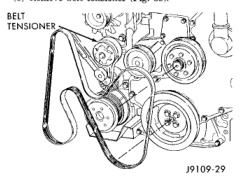
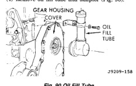

# 9-194 5.9L DIESEL ENGINE

## REMOVAL AND INSTALLATION (Continued)

*Fig. 89 Crankshaft End Clearance - showing crankshaft end clearance measurement diagram with specifications:*

### CRANKSHAFT FRONT SEAL

(1) Remove fan drive assembly.
(2) Remove the fan belt (Fig. 89).
(3) Remove belt tensioner (Fig. 89).

*Fig. 90 Drive Belt Installation - showing belt tensioner and pulley arrangement]*

(4) Remove oil fill tube and adapter (Fig. 90).

*Fig. 91 Oil Fill Tube - showing gear housing cover and oil fill tube]*

(5) Remove vibration damper.

(6) Remove the bolts that hold the gear cover to the gear housing.
(7) Remove the gear cover from the housing, taking care not to mar the gasket surfaces (Fig. 91).
(8) Clean the old gasket residue from the back of the gear cover and front of the gear housing.

[Figure: Fig. 91 Gear Housing and Cover - showing gear housing cover and gear housing]

### INSTALLATION

(1) Lubricate the front gear train with clean engine oil.
(2) Thoroughly clean the front seal area of the crankshaft. The seal lip and the sealing surface on the crankshaft must be free from all oil residue to prevent seal leaks.
(3) Apply a bead of Loctite 277 to the outside diameter of the seal.
(4) Install the seal into the rear of the cover using a plastic hammer and the alignment/installation tool provided in the seal kit to prevent damage to the seal carrier, hit the alignment/installation tool alternately at the 12, 3, 6 and 9 o'clock positions.
(5) Install the pilot from the seal kit onto the crankshaft.
(6) Using the pilot as an alignment tool, install the cover and a new gasket.
(7) Install the cover bolts and tighten to 24 N·m (18 ft. lbs.) torque. Remove pilot tool.
(8) Install the oil fill tube and mounting bolts. Tighten the bolts to 43 N·m (32 ft. lbs.) torque.
(9) Install the vibration damper. DO NOT tighten the bolts to the correct torque value at this time.
(10) Install the belt tensioner. Tighten the mounting bolts to 43 N·m (32 ft. lbs.) torque.
(11) Raise the belt tensioner to install the belt.
(12) Tighten the vibration damper bolts to 125 N·m (92 ft. lbs.) torque. Use an engine barring tool to keep the engine from rotating during tightening operation.
(13) Install the fan drive assembly.