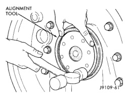
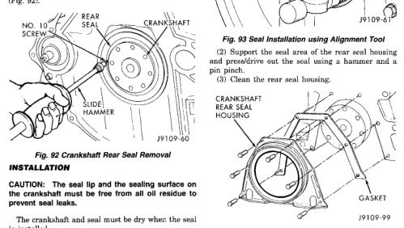

# REMOVAL AND INSTALLATION (Continued)

## CRANKSHAFT REAR SEAL

### REMOVAL

(1) Remove the transmission (refer to Group 21, Transmission for the proper procedure).
(2) Remove the clutch cover.
(3) Remove the clutch plate.
(4) Remove the flywheel.
(5) Drill holes 180° apart into the seal. Be careful not to get the drill against the crankshaft.
(6) Install #10 sheet metal screws in the drilled holes and remove the rear seal with a slide hammer (Fig. 92).

*Fig. 92 Crankshaft Rear Seal Removal]*
- NO. 10 SCREW
- REAR SEAL
- CRANKSHAFT
- SLIDE HAMMER

### INSTALLATION

**CAUTION:** The seal lip and the sealing surface on the crankshaft must be free from all oil residue to prevent seal leaks.

The crankshaft and seal must be dry when the seal is installed.

(1) Install the seal pilot, provided in the replacement kit, on the crankshaft. Push the seal on the pilot and crankshaft.
(2) Remove the seal pilot.
(3) Use the alignment tool to install the seal to the correct depth in the housing. Use a hammer to drive the seal into the housing until the alignment tool stops against the housing (Fig. 93).
(4) Hit the tool at the 12, 3, 6 and 9 o'clock positions to drive the seal evenly and prevent bending the seal housing.

*Fig. 93 Seal Installation using Alignment Tool]*
- ALIGNMENT TOOL

## CRANKSHAFT REAR SEAL HOUSING

### REMOVAL

(1) Remove the rear seal housing and gasket (Fig. 94).

[Figure: Fig. 94 Crankshaft Rear Seal Housing/Gasket]
- CRANKSHAFT REAR SEAL HOUSING
- GASKET

### INSTALLATION

(1) Clean and dry the rear crankshaft sealing surface. The seal lip and the sealing surface on the crankshaft must be free from all oil residue to prevent seal leaks.
(2) Assemble the rear seal housing and gasket to the cylinder block with the bolts.
(3) Align the seal housing to the crankshaft with the alignment tool provided in the seal kit (Fig. 94). Make sure the seal housing is level with both sides of the block oil pan rail. Tighten the bolts to 9 N·m (7 ft. lbs.) torque.
(4) Remove the alignment tool and trim the gasket even with the oil pan mounting surface (Fig. 95).
(5) Install the seal pilot (provided with the replacement kit) onto the crankshaft. Push the seal onto the crankshaft (Fig. 96).
(6) Remove the seal pilot.