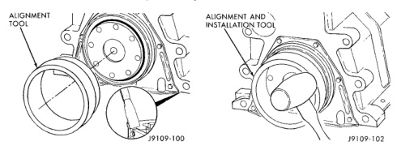
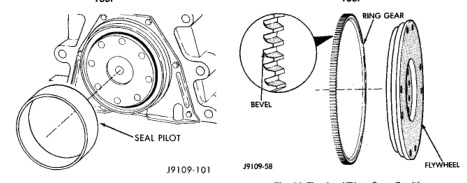

# REMOVAL AND INSTALLATION (Continued)

*Fig. 95 Crankshaft Rear Seal Housing Alignment Tool]*
- ALIGNMENT TOOL

*Fig. 97 Crankshaft Rear Seal Pilot]*
- SEAL PILOT

[Figure: Fig. 97 Crankshaft Rear Seal Alignment/Installation Tool]
- ALIGNMENT AND INSTALLATION TOOL

(7) Use alignment and installation tool packaged in the seal kit (Fig. 97). Alternately, drive the seal at the 12, 3, 6 and 9 o'clock positions to prevent bending the seal carrier during installation.

## FLYWHEEL RING GEAR

### REMOVAL

(1) Remove the transmission.
(2) Remove the clutch cover.
(3) Remove the clutch plate.
(4) Remove the flywheel.
(5) Use a drift pin to drive the ring gear from the flywheel (Fig. 19). Strike the gear at several points around the wheel until it is off.
(6) Heat the new ring for 20 minutes in an oven preheated to 127°C (250°F).
(7) Install the gear. The gear must be installed so the bevel on the teeth is towards the crankshaft side of the flywheel (Fig. 98).

[Figure: Fig. 98 Flywheel/Ring Gear Position]
- RING GEAR
- BEVEL
- FLYWHEEL

### INSTALLATION

**CAUTION:** Never use the timing pin to hold the crankshaft in position.

(1) Use the engine barring tool to hold the crankshaft when the flywheel bolts are being tightened.
(2) Tighten the bolts in a criss-cross pattern to 137 N·m (101 ft. lbs.) torque.

## CRANKSHAFT GEAR

### REMOVAL

Remove the crankshaft gear using a heavy duty puller.

### INSTALLATION

Remove all burrs and make sure the gear surface on the end of the crankshaft is smooth.

If removed, install a new alignment pin. Drive the pin in using a ball-peen hammer, leaving it protruding.