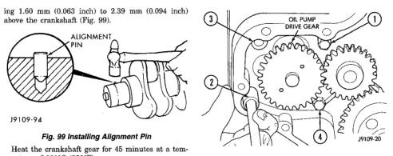
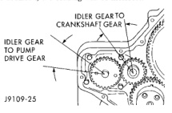

# BR — 5.9L DIESEL ENGINE 9 - 197

## REMOVAL AND INSTALLATION (Continued)

ing 1.60 mm (0.063 inch) to 2.39 mm (0.094 inch) above the crankshaft (Fig. 99).

*Fig. 100 Installing Alignment Pin]*
- ALIGNMENT PIN

Heat the crankshaft gear for 45 minutes at a temperature of 121°C (250°F).

**CAUTION: DO NOT heat the gear longer than 45 minutes.**

**WARNING: WEAR PROTECTIVE GLOVES TO PREVENT INJURY.**

Position the gear with the timing mark out and install it on the crankshaft using the alignment pin. Make sure the gear contacts the shoulder.

### OIL PUMP

The non-intercooled turbocharged engine oil pumps can not be used on intercooled engines.

#### REMOVAL

(1) Remove the radiator (refer to Group 7, Cooling System for the proper procedure).
(2) Loosen the crankshaft vibration damper and remove the drive belt.
(3) Remove the fan clutch assembly.
(4) Remove the fan hub.
(5) Remove the oil fill tube.
(6) Remove the crankshaft vibration damper.
(7) Remove the gear housing cover.
(8) Remove the four mounting bolts and pull the pump from the bore in the cylinder block (Fig. 100).

#### INSTALLATION

(1) Lubricate the pump with clean engine oil. Filling the pump with clean engine oil during installation will help to prime the pump at engine start up. Make sure the idler gear pin is installed in the locating bore in the cylinder block.
(2) Install the pump. Tighten the oil pump mounting bolts in two steps and in the sequence shown (Fig. 100).
- Step 1—Tighten to 5 N·m (44 in. lbs.) torque.
- Step 2—Tighten to 24 N·m (18 ft. lbs.) torque.

*Fig. 101 Oil Pump Removal]*
- 1. OIL PUMP DRIVE GEAR
- 2. (gear component)
- 3. (gear component)
- 4. IDLER GEAR

(3) The back plate on the pump seats against the bottom of the bore in the cylinder block. When the pump is correctly installed, the flange on the pump will not touch the cylinder block.
(4) Measure the idler gear to pump drive gear backlash and the idler gear to crankshaft gear backlash (Fig. 101). The backlash should be 0.080-0.330 mm (0.003-0.013 inch). If the backlash is out of limits, replace the oil pump drive gear and the idler gear.
(5) If the adjoining gear moves when you measure the backlash, the reading will be incorrect.

[Figure: Fig. 101 Idler Gear to Pump Drive Gear and Crankshaft Gear Backlash]
- IDLER GEAR TO CRANKSHAFT GEAR
- IDLER GEAR TO PUMP DRIVE GEAR

### OIL FILTER BYPASS VALVE

#### REMOVAL

(1) Remove the oil cooler cover (Fig. 102).
(2) Remove the valve from the cooler cover (Fig. 102).

#### INSTALLATION

(1) Drive the new valve in until it bottoms against the step in the bypass valve bore (Fig. 103).
(2) Install the oil cooler cover.