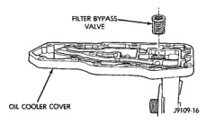
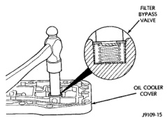
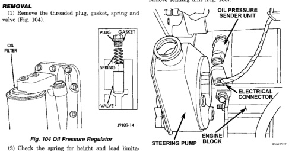
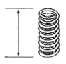
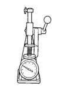

# 9 - 198 5.9L DIESEL ENGINE — BR

## REMOVAL AND INSTALLATION (Continued)

*Fig. 102 Removing Filter Bypass Valve]*
- FILTER BYPASS VALVE
- OIL COOLER COVER

*Fig. 4 Installing New Filter Bypass Valve]*
- FILTER BYPASS VALVE
- OIL COOLER COVER

### OIL PRESSURE REGULATOR VALVE AND SPRING

#### REMOVAL

(1) Remove the threaded plug, gasket, spring and valve (Fig. 104).

*Fig. 5 Oil Pressure Regulator]*
- OIL PAN
- PLUG
- GASKET
- SPRING
- VALVE

(2) Check the spring for height and load limitations (Fig. 105). Replace the spring if out of limits.

*Fig. 105 Oil Pressure Regulator Spring Check]*

VALVE OPEN
- HEIGHT: 41.25mm (1.62 inch)
- LOAD: 126 N (28.4 lbf)

FREE LENGTH: 66mm (2.6 inch)

#### INSTALLATION

(1) Clean and inspect the plunger, bore and seat before assembly. The plunger must move freely in the valve bore.
(2) Install the valve, spring, gasket and plug. Tighten the plug to 80 N·m (60 ft. lbs.) torque.

### VACUUM PUMP

#### REMOVAL

(1) Disconnect battery negative cable.
(2) Position drain pan under power steering pump.
(3) Disconnect vacuum and steering pump hoses.
(4) Disconnect oil pressure sender wires and remove sending unit (Fig. 106).

*Fig. 106 Oil Pressure Sender Unit]*
- OIL PRESSURE SENDER UNIT
- ELECTRICAL CONNECTOR
- STEERING PUMP
- CYLINDER BLOCK