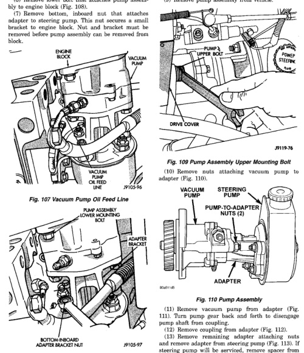

# 5.9L DIESEL ENGINE - REMOVAL AND INSTALLATION (Continued)

(5) Disconnect lubricating oil feed line from fitting at underside of vacuum pump (Fig. 107).

(6) Remove lower bolt that attaches pump assembly to engine block (Fig. 108).

(7) Remove bottom, inboard nut that attaches adapter to steering pump. This nut secures a small bracket to engine block. Nut and bracket must be removed before pump assembly can be removed from block.

*Fig. 107 Vacuum Pump Oil Feed Line]*
- ENGINE
- VACUUM PUMP
- VACUUM PUMP OIL FEED LINE

[Figure: Fig. 108 Vacuum Pump Mounting]
- PUMP ASSEMBLY LOWER MOUNTING BOLT
- PUMP-TO-ADAPTER BRACKET NUT

(8) Remove upper bolt that attaches pump assembly to engine block (Fig. 109).

(9) Remove pump assembly from vehicle.

[Figure: Fig. 109 Pump Assembly Upper Mounting Bolt]
- PUMP'S UPPER BOLT
- POWER STEERING PUMP
- DRIVE COVER

(10) Remove nuts attaching vacuum pump to adapter (Fig. 110).

[Figure: Fig. 110 Pump Assembly]
- VACUUM PUMP
- STEERING PUMP
- PUMP-TO-ADAPTER NUTS (2)
- ADAPTER

(11) Remove vacuum pump from adapter (Fig. 111). Turn pump gear back and forth to disengage pump shaft from coupling.

(12) Remove coupling from adapter (Fig. 112).

(13) Remove remaining adapter attaching nuts and remove adapter from steering pump (Fig. 113). If steering pump will be serviced, remove spacer from each inboard mounting stud on pump.