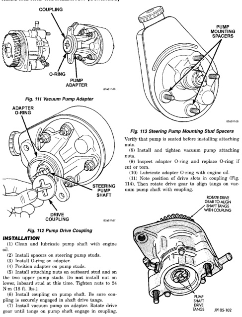

# 5.9L DIESEL ENGINE - REMOVAL AND INSTALLATION (Continued)

*Fig. 111 Vacuum Pump Adapter]*
- COUPLING
- O-RING
- PUMP ADAPTER

[Figure: Fig. 112 Pump Drive Coupling]
- ADAPTER O-RING
- STEERING PUMP SHAFT
- DRIVE COUPLING

[Figure: Fig. 113 Steering Pump Mounting Stud Spacers]
- PUMP MOUNTING SPACERS

Verify that pump is seated before installing attaching nuts.

(8) Install and tighten vacuum pump attaching nuts.

(9) Inspect adapter O-ring and replace O-ring if cut or torn.

(10) Lubricate adapter O-ring with engine oil.

(11) Note position of drive slots in coupling (Fig. 114). Then rotate drive gear so slots tangle on vacuum pump shaft with coupling.

[Figure: Fig. 114 Pump Shaft Drive Tangs]
- BRONZE DRIVE GEAR MUST ENGAGE SHAFT TANGS WITH COUPLING
- PUMP SHAFT DRIVE TANGS

## INSTALLATION

(1) Clean and lubricate pump shaft with engine oil.

(2) Install spacers on steering pump studs.

(3) Install O-ring on adapter.

(4) Position adapter on pump studs.

(5) Install and tighten upper adapter nuts and nut on the two upper pump studs. Do not install nut on lower, inboard stud at this time. Tighten nuts to 24 N·m (18 ft. lbs.).

(6) Install coupling on pump shaft. Be sure coupling is fully seated on pump shaft splines.

(7) Install vacuum pump on adapter. Rotate drive gear until tangs on pump shaft engage in coupling.