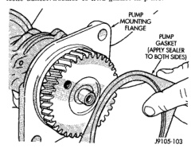
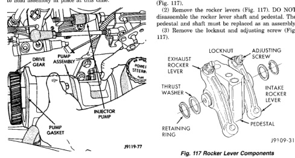

# BR — 5.9L DIESEL ENGINE — 9 - 201

## REMOVAL AND INSTALLATION (Continued)

(12) Verify that pump is seated in adapter and coupling.

(13) Install and tighten pump attaching nuts and washers.

(14) Position new gasket on vacuum pump mounting flange (Fig. 115). Use Mopar Perfect Seal, or silicone adhesive/sealer to hold gasket in place.

*Fig. 115 Pump Mounting Flange Gasket]*
- PUMP MOUNTING FLANGE
- PUMP GASKET
- UPPER SEALING PLUG/PIN SEALS

(15) Insert pump assembly upper attaching bolt in mounting flange and gasket. Use sealer or grease to hold bolt in place if necessary.

(16) Position pump assembly on engine and install upper bolt (Fig. 116). Tighten upper bolt only enough to hold assembly in place at this time.

*Fig. 116 Installing Pump Assembly On Engine]*
- GEAR HOUSING ASSEMBLY
- POWER STEERING PUMP
- INJECTOR PUMP
- PUMP GASKET

(17) Working from under vehicle, install pump assembly lower attaching bolt. Then tighten upper and lower bolt to 77 N·m (57 ft. lbs.).

(18) Position bracket on steering pump inboard stud. Then install remaining adapter attaching nut on stud. Tighten nut to 24 N·m (18 ft. lbs.).

(19) Connect oil feed line to vacuum pump connector and tighten line fitting.

(20) Install oil pressure sender and connect sender wires.

(21) Connect steering pump pressure and return lines to pump. Tighten pressure line fitting to 30 N·m (22 ft. lbs.).

(22) Connect vacuum hose to vacuum pump.

(23) Connect battery cables, if removed.

(24) Fill power steering pump reservoir.

(25) Purge air from steering pump lines. Start engine and slowly turn steering wheel left and right to circulate fluid and purge air from system.

(26) Stop engine and top off power steering reservoir fluid level.

(27) Start engine and verify that steering action is correct. Do this before moving vehicle.

## DISASSEMBLY AND ASSEMBLY

### ROCKER LEVERS

#### DISASSEMBLE

(1) Remove the retaining rings and thrust washers (Fig. 117).

(2) Remove the rocker levers (Fig. 117). DO NOT disassemble the rocker lever shaft and pedestal. The pedestal and shaft must be replaced as an assembly.

(3) Remove the locknut and adjusting screw (Fig. 117).

[Figure: Fig. 117 Rocker Lever Components]
- EXHAUST ROCKER LEVER
- THRUST WASHERS
- RETAINING RING
- LOCKNUT
- ADJUSTING SCREW
- INTAKE ROCKER LEVER
- PEDESTAL

(4) Clean all parts in a strong solution of laundry detergent in hot water.