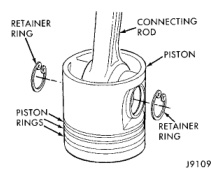
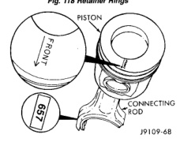

# 9 - 202 — 5.9L DIESEL ENGINE — BR

## DISASSEMBLY AND ASSEMBLY (Continued)

(5) Use compressed air to dry the parts after rinsing in clean hot water. The pedestals are made from powdered metal and may continue to show wetness after they have been cleaned and dried.

(6) Inspect for excessive wear in the bore and the contact surface for the valve stem.

(7) Measure the rocker lever bore diameter. The maximum diameter is 19.05 mm (0.75 inch). Replace if out of limits.

(8) Inspect the pedestal and shaft.

(9) Measure the shaft diameter. The minimum diameter is 18.94 mm (0.746 inch). Replace if out of limits.

#### ASSEMBLE

(1) Install the adjusting screw and locknut.

(2) Lubricate the shaft with clean engine oil. Be sure to assemble the intake and exhaust rocker levers in the correct location.

(3) Position the levers on the rocker shaft. Install the thrust washers.

(4) Clean the push rods in the hot soapy water.

(5) Inspect the push rod ball and socket for signs of scoring or cracks where the ball and the socket are pressed into the tube.

(6) Check the push rods for roundness and straightness.

(7) Install the push rods into the sockets of the valve tappets. Lubricate the push rod sockets with clean engine oil.

(8) Make sure the rocker lever adjusting screws are completely backed out.

### PISTON AND CONNECTING ROD ASSEMBLY

#### DISASSEMBLE

(1) Remove the retainer rings from the piston (Fig. 118).

(2) Remove the piston pin. Heating the piston is not required.

(3) Remove the piston rings (Fig. 118).

*Fig. 118 Retainer Rings]*
- RETAINER RING
- CONNECTING ROD
- PISTON
- PISTON RINGS
- PISTON RETAINER RING

#### INSPECT

(1) Be sure the FRONT marking on the piston and the numbers on the rod and cap are oriented (Fig. 119). Install the retaining ring into the pin groove on the FRONT side of the piston.

(2) Lubricate the pin and bore with engine oil.

(3) Install the piston pin in the opposite side of the installed retaining pin. Pistons do not require heating to install the pin, however, the piston does need to be at room temperature or above.

(4) Determine the piston diameter and obtain the appropriate ring set. The piston rings can be identified as shown in (Fig. 120).

*Fig. 119 Proper Markings on the Piston and Connecting Rod]*
- PISTON
- FRONT
- CONNECTING ROD

[Figure: Fig. 120 Piston Ring Identification]
- TOP RING (TOP)
- INTERMEDIATE RING
- OIL CONTROL RING

(5) Position each ring in the cylinder and use a piston to square it with the bore at a depth of 89.0 mm (3.5 inch) - (Fig. 121).

(6) Use a feeler gauge to measure the piston ring gap (Fig. 122).

(7) The top surface of all of the rings are identified with the word TOP or the supplier's MARK. Assemble the rings with the word TOP or the supplier's MARK up.