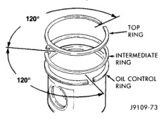

# 5.9L DIESEL ENGINE 9 - 203

## DISASSEMBLY AND ASSEMBLY (Continued)

*Fig. 121 Position of Ring in Cylinder Bore*

*Fig. 122 Piston Ring Gap - Shows feeler gauge measuring ring gap in cylinder bore with ring gap positions marked]*

| Ring | MINIMUM | MAXIMUM |
|---|---|---|
| TOP | 0.400 mm (0.0160 inch) | 0.700 mm (0.0275 inch) |
| INTERMEDIATE | 0.250 mm (0.0100 inch) | 0.550 mm (0.0215 inch) |
| OIL CONTROL | 0.250 mm (0.0100 inch) | 0.550 mm (0.0215 inch) |

(8) Position the oil ring expander in the oil control ring groove (bottom groove).

(9) Install the oil control ring with the end gap OPPOSITE the ends on the expander (Fig. 123).

(10) Install the intermediate piston ring in the second groove (Fig. 121).

(11) Install the top piston ring in the top groove (Fig. 124).

(12) Position the rings as shown in (Fig. 125).

(13) Install the original bearings as removed or install new bearings. If new bearings are used, be sure to obtain the proper bearing clearance (Fig. 126).

(14) DO NOT lubricate the side of the bearing that is against the connecting rod or cap. Apply a coat of Lubriplate 105, or equivalent to the new upper and lower connecting rod bearings.

*Fig. 123 Oil Control Ring/Expander Location in Groove*

[Figure: Fig. 124 Piston Ring Installation Tool
- PISTON RING INSTALLATION TOOL]

[Figure: Fig. 125 Piston Ring Positioning
- TOP
- 120°
- INTERMEDIATE RING
- 120°
- OIL CONTROL]