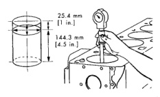
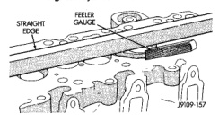

# 9 - 204 5.9L DIESEL ENGINE

*Fig. 127 Connecting Rod Bearing Size Location*

## CLEANING AND INSPECTION

### OIL COOLER ELEMENT AND GASKET

#### CLEANING AND INSPECTION

Clean the sealing surfaces.

Apply 483 kPa (70 psi) air pressure to the element to check for leaks. If the element leaks, replace the element.

### CYLINDER HEAD

#### INSPECTION

Remove the cup plugs and inspect the coolant passages. A large build up of rust and lime will require removal of the cylinder block for cleaning in a hot tank.

Inspect the cylinder bores for damage or excessive wear. Rotate the crankshaft so the piston is at Bottom Dead Center (BDC) to inspect the bores.

Measure the cylinder bores (Fig. 127). DO NOT proceed with in-chassis repair if the bores are damaged or worn beyond the limits (refer to Cylinder Bore Repair - Cylinder Block).

Check the top surface for damage caused by the cylinder head gasket leaking between cylinders. Inspect the block and head surface for nicks, erosion, etc.

Check the head distortion (Fig. 128). The distortion of the combustion deck face is not to exceed 0.010 mm (0.0004 inch) in any 50.8 mm (2.00 inch) diameter. Overall variation end to end or side to side 0.30 mm (0.012 inch).

DO NOT proceed with the in-chassis overhaul if the cylinder head or block surface is damaged or not flat (within specifications).

#### REFACING HEAD SURFACE

The cylinder head combustion deck may be refaced in whatever increments necessary to clean up the surface and maintain the surface finish and flatness tolerances. The combined total of stock removed must not exceed 1.00 mm (0.03937 inch). The amount of stock removed each time must be steel stamped

*Fig. 128 Cylinder Bore Diameter - Shows piston with measurements 25.4 mm (1 in.) and 144.3 mm (4.3 in.)]*

| Specification | Measurement |
|---|---|
| MIN. | 102.0 mm (4.0157 inch) |
| MAX. | 102.116 mm (4.0203 inch) |
| Out-of-Round | 0.038 mm (0.0015 inch) |
| Taper | 0.76 mm (0.003 inch) |

Oversize pistons and rings are available for bored cylinder blocks.

*Fig. 129 Cylinder Head Combustion Deck Face Measurement - Shows straight edge and feeler gauge measurement across cylinder head deck]*

above combustion deck edge, on the lower right hand corner of the rear face (Fig. 129). Check valve protrusion after head surface refacing.

Surface finish requirements are 1.5-3.2 micrometers (60-126 microinch).

#### CLEANING

Clean the carbon from the injector nozzle seat with a nylon or brass brush.

Scrape the gasket residue from all gasket surfaces.

Wash the cylinder head in hot soapy water solution (88°C or 140°F).

After rinsing, use compressed air to dry the cylinder head.

Polish the gasket surface with 400 grid paper. Use an orbital sander or sanding block to maintain a flat surface.