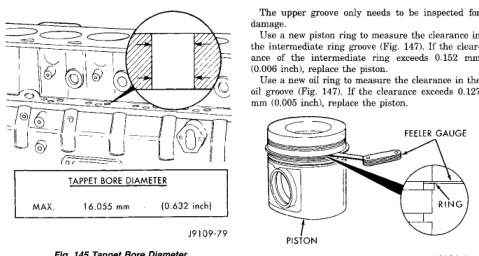
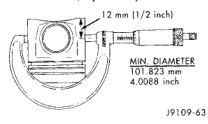
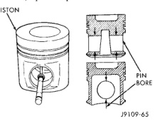

# CLEANING AND INSPECTION (Continued)

*Fig. 146 Tappet Bore Diameter - showing measurement diagram with tappet bore diameter specification]*
- MAX. 16.055 mm (0.632 inch)

The upper groove only needs to be inspected for damage.

Use a new oil ring to measure the clearance in the intermediate ring groove (Fig. 147). If the clearance of the intermediate ring exceeds 0.152 mm (0.006 inch), replace the piston.

Use a new oil ring to measure the clearance in the oil groove (Fig. 147). If the clearance exceeds 0.127 mm (0.005 inch), replace the piston.

*Fig. 147 Intermediate and Oil Ring Clearances - showing feeler gauge measurement between ring and piston groove]*
- FEELER GAUGE
- RING
- PISTON

Soak the pistons in cold parts cleaner. Soaking the pistons overnight will usually loosen the carbon deposits.

Wash the pistons and rods in a strong solution of laundry detergent and hot water.

Clean the remaining deposits from the ring grooves with the square end of a broken ring. DO NOT use a ring groove cleaner and be sure not to scratch the ring sealing surface in the piston groove.

Wash the pistons again in a detergent solution or solvent.

Rinse the pistons. Use compressed air to dry.

## INSPECTION

Inspect the rod journals for deep scratches, indication of overheating and other damage.

Inspect the pistons for damage and excessive wear. Check top of the piston, ring grooves, skirt and pin bore.

Measure the piston skirt diameter (Fig. 146). If the piston is out of limits, replace the piston.

*Fig. 148 Piston Skirt Diameter - showing measurement location on piston skirt]*
- MIN. DIAMETER 101.873 mm (4.0068 inch)
- 12 mm (1/2 inch)

Measure the pin bore (Fig. 148). The maximum diameter is 40.025 mm (1.5758 inch). If the bore is over limits, replace the piston.

[Figure: Fig. 148 Piston Pin Bore - showing cross-section of piston with pin bore measurement location]
- PISTON
- PIN BORE

Inspect the piston pin for nicks, gouges and excessive wear.

Measure the pin diameter (Fig. 149). The minimum diameter is 39.990 mm (1.5744 inch). If the diameter is out of limits, replace the pin.

Inspect the rod for damage and wear. The I-Beam section of the connecting rod cannot have dents or other damage. Damage to this part can cause stress risers which will progress to breakage.

Measure the connecting rod pin bore (Fig. 150). The maximum diameter is 40.042 mm (1.5764 inch). If out of limits, replace the connecting rod.