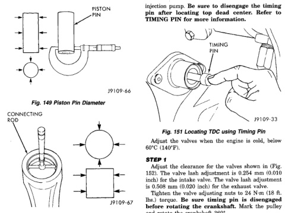
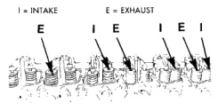

# CLEANING AND INSPECTION (Continued)

*Fig. 149 Piston Pin Diameter - showing measurement of piston pin with dial indicator]*
- PISTON PIN

*Fig. 150 Connecting Rod Pin Bore - showing measurement of connecting rod bore with dial indicator]*
- CONNECTING ROD

## CRANKSHAFT

### CLEANING AND INSPECTION

Clean the crankshaft oil gallery holes with a nylon brush.

Rinse in clean solvent and dry with compressed air.

Inspect the front and rear seal contact areas of the crankshaft for scratches or grooving.

The service seal kit will position the seal slightly deeper into the seal bore so it will contact the crankshaft at a different location. If this has already been done and the crankshaft has two worn areas, install a wear sleeve to provide a new contact surface for the seal.

Inspect the rod and main journal for deep scores, signs of overheating and other abnormal marks.

## ADJUSTMENTS

### VALVE CLEARANCE ADJUSTMENT

Use the timing pin to locate Top Dead Center (TDC) for cylinder No. 1 (Fig. 151). The timing pin is located at the back of the gear housing and below the injection pump. Be sure to disengage the timing pin after locating top dead center. Refer to TIMING PIN for more information.

*Fig. 151 Locating TDC using Timing Pin - showing timing pin location on engine]*
- TIMING PIN

Adjust the valves when the engine is cold, below 60°C (140°F).

#### STEP 1

Adjust the clearance for the valves shown in (Fig. 152). The valve lash adjustment is 0.254 mm (0.010 inch) for the intake valve. The valve lash adjustment is 0.508 mm (0.020 inch) for the exhaust valve.

Tighten the valve adjusting nuts to 24 N·m (18 ft. lbs.) torque. Be sure timing pin is disengaged before rotating the crankshaft. Mark the pulley and rotate the crankshaft 360°.

[Figure: Fig. 152 Adjust Valve Clearance—Step 1 - showing valve arrangement diagram]
- I = INTAKE
- E = EXHAUST
- E I E I E I
- Cylinders marked 1 through 6
- FRONT ⟹

#### STEP 2

Adjust the clearance for the valves shown in (Fig. 153). The valve lash adjustment is 0.254 mm (0.010 inch) for the intake valve. The valve lash adjustment is 0.508 mm (0.020 inch) for the exhaust valve. Tighten the bolts to 24 N·m (18 ft. lbs.) torque.