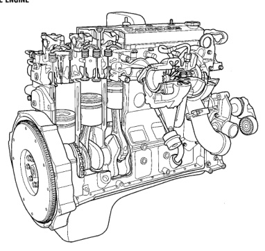

## DESCRIPTION AND OPERATION

### 5.9L DIESEL ENGINE

*Fig. 1 Cummins 24 Valve Turbo Diesel Engine - Cutaway view showing internal components including pistons, crankshaft, cylinder head, turbocharger, and external accessories*

### 5.9L DIESEL ENGINE DESCRIPTION

| Specification | Value |
|---------------|-------|
| Engine type | In-line 6 (Diesel Turbo) |
| Bore and Stroke | 102.0 x 120.0 mm (4.02 x 4.72 in.) |
| Displacement | 5.9L (359 cu. in.) |
| Compression Ratio | 16.5:1 |
| Horsepower (A/T) | 215 @ 2700 rpm |
| Horsepower (M/T) | 235 @ 2700 rpm |
| Torque (A/T) | 420 ft. lbs. @ 1600 rpm |
| Torque (M/T) | 460 ft. lbs. @ 1600 rpm |
| Firing Order | 1-5-3-6-2-4 |
| Lubrication | Pressure Feed-Full Flow Filtration w/Bypass Valve |
| Cooling System | Liquid Cooled - Forced Circulation |
| Cylinder Block | Cast Iron |
| Crankshaft | Induction Hardened Forged Steel |
| Cylinder Head | Cast Iron |
| Combustion Chambers | High Swirl Bowl |
| Camshaft | Chilled Ductile Iron |
| Pistons | Cast Aluminum |
| Connecting Rods | Forged Steel |

The cylinders are numbered from front to rear, 1 to 6. The firing order is 1-5-3-6-2-4.

*Fig. 2 Firing Order - Diagram showing cylinder numbering 1 through 6 from front to rear with firing sequence 1-5-3-6-2-4*