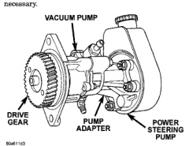

# 5.9L 24-VALVE TURBO DIESEL ENGINE 9-7

## DESCRIPTION AND OPERATION (Continued)

pump through an oil line at the underside of the pump housing.

The complete assembly must be removed in order to service either pump. However, the power steering pump can be removed and serviced separately when necessary.

### VACUUM PUMP

*Fig. 1 Diesel Vacuum & Power Steering Pump Assembly]*
- DRIVE GEAR
- PUMP ADAPTER
- POWER STEERING PUMP

The vacuum pump is not a serviceable component. If diagnosis indicates a pump malfunction, the pump must be replaced as an assembly. Do not disassemble or attempt to repair the pump.

The combined vacuum and steering pump assembly must be removed for access to either pump. However, the vacuum pump can be removed without having to disassemble the power steering pump.

If the power steering pump requires service, simply remove the assembly and separate the two pumps. Refer to the pump removal and installation procedures in this section.

### VACUUM PUMP OPERATION

Vacuum pump output is transmitted to the HEVAC, speed control, and EGR systems through a supply hose. The hose is connected to an outlet port on the pump housing and uses an in-line check valve to retain system vacuum when vehicle is not running.

Pump output ranges from a minimum of 8.5 to 25 inches vacuum.

The pump rotor and vanes are rotated by the pump drive gear. The drive gear is operated by the camshaft gear.

## DIAGNOSIS AND TESTING

### ENGINE OIL PRESSURE

(1) Remove the engine oil pressure sensor and install Oil Pressure Line and Gauge Tool C-3292 with a suitable adapter.

(2) Start engine and warm to operating temperature.

(3) Record engine oil pressure and compare with engine oil pressure chart.

**CAUTION: If engine oil pressure is zero at idle, DO NOT RUN THE ENGINE.**

#### Engine Oil Pressure (MIN)

| At Idle | 68.9 kPa (10 psi) |
| At 2000 rpm | 206.9 kPa (30 psi) |

If minimum engine oil pressure is below these ranges, refer to the Engine Mechanical Diagnosis Charts in this section.

(4) Remove oil pressure gauge and install the oil pressure sensor. Tighten the sensor to 16 N·m (144 in. lbs.) torque.