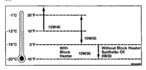
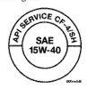
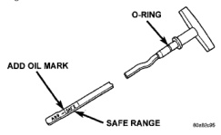

not hold its reading, then there is an open in the harness and it should be repaired or replaced. (4) If the vacuum loss is still not detected at this point, then the pump and harness are not the cause of the low vacuum condition. Apply vacuum to the related components of the vacuum supply system (i.e. valves, servos, solenoids, etc.) to find the source of the vacuum loss.

NEW OR USED ENGINE OIL CAN BE WARNING: IRRITATING TO THE SKIN. AVOID PROLONGED OR REPEATED SKIN CONTACT WITH ENGINE OIL. CONTAMINANTS IN USED ENGINE OIL, CAUSED BY INTERNAL COMBUSTION, CAN BE HAZARDOUS TO YOUR HEALTH. THOROUGHLY WASH EXPOSED SKIN WITH SOAP AND WATER. DO NOT WASH SKIN WITH GASOLINE. DIESEL FUEL, THINNER, OR SOLVENTS. HEALTH PROBLEMS CAN RESULT. DO NOT POLLUTE. DISPOSE OF USED ENGINE OIL PROPERLY.

CAUTION: Do not use non-detergent or straight mineral oil when adding or changing crankcase lubricant. Engine failure can result.

Standard engine-oil identification notations have been adopted to aid in the proper selection of engine oil. The identifying notations are located on the label of engine oil plastic bottles and the top of engine oil cans. In diesel engines, use an engine oil that conforms to API Service Grade CF-4 or CG-4/SH (Fig. 8). MOPAR® provides an engine oil that conforms to this particular grade.

*Fig. 8 API Service Grade Certification Label-Diesel Engine Oll*

An SAE viscosity grade is used to specify the viscosity of engine oil. SAE 15W-40 specifies a multiple viscosity engine ail. When choosing an engine oil, consider the range of temperatures the vehicle will be operated in before the next oil change. Select an engine oil that is best suited to your area's particular ambient temperature range and variation. For diesel engines, refer to (Fig. 9).

*Fig. 9 Engine Oil Viscosity Recommendation Diesel Engines*

CAUTION: Do not overfill crankcase with engine oll, oil foaming and oil pressure loss can result.

To ensure proper lubrication of an engine, the engine oil must be maintained at an acceptable level. The acceptable oil level is in the SAFE RANGE on the engine oil dipstick (Fig. 10). Unless the engine has exhibited loss of oil pressure, run the engine for about five minutes before checking oil level. Checking engine oil level of a cold engine is not accurate.

*Fig. 10 Oll Level Indicator (Dipstick)*

(1) Position vehicle on level surface. (2) With engine OFF, allow approximately ten minutes for oil to settle to bottom of crankcase, remove engine oil dipstick. (3) Wipe dipstick clean.
