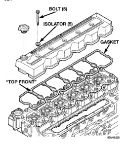

(4) Replace dipstick and verify it is seated in the tube. (5) Remove dipstick, with handle held above the tip, take oil level reading. (6) Add oil only if level is below the SAFE RANGE area on the dipstick. (7) Replace dipstick

WARNING: HOT OIL CAN CAUSE PERSONAL INJURY.

NOTE: Change engine oil and filter at intervals specified in the owner's manual.

(1) Operate the engine until the water temperature reaches 60℃ (140°F). Shut the engine off. (2) Use a container that can hold at least 14 liters (15 quarts) to hold the used oil. Remove the oil drain plug and drain the used engine oil into the container. (3) Always check the condition of the used oil. This can give you an indication of engine problems that might exist. · Thin, black oil indicates fuel dilution. · Milky discoloration indicates coolant dilution. (4) Clean the area around the oil filter head. Remove the filter using a 90-95 mm filter wrench. (5) Clean the gasket surface of the filter head. The filter canister O-Ring seal can stick on the filter head. Make sure it is removed. (6) Fill the oil filter element with clean oil before installation, Use the same type oil that will be used in the engine. (7) Apply a light film of lubricating oil to the sealing surface before installing the filter.

CAUTION: Mechanical over-tightening may distort the threads or damage the filter element seal.

(8) Install the filter as specified by the filter manufacturer. (9) Clean the drain plug and the sealing surface of the pan. Check the condition of the threads and sealing surface on the oil pan and drain plug. (10) Install the drain plug. Tighten the plug to 60 N.m (44 ft. lbs.) torque. (11) Use only High-Quality Multi-Viscosity lubricating oil in the Cummins Turbo Diesel engine. Choose the correct oil for the operating conditions outlined in Group 0. Lubrication and Maintenance. (12) Fill the engine with the correct grade of new oil. Refer to Group 0. Lubrication and Maintenance for the correct oil fill capacity. (13) Start the engine and operate it at idle for several minutes. Check for leaks at the filter and drain plug.

(14) Stop engine. Wait several minutes to allow the oil to drain back to the pan and check the level again.

Care should be exercised when disposing of used engine oil after it has been drained from a vehicle's engine.

NOTE: To obtain accurate readings, valve lash measurements AND adjustments should only be performed when the engine coolant temperature is less than 60° C (140° F).

The 24-valve overhead system is a "low-maintenance" design. Routine adjustments are no longer necessary, however, measurement should still take place when trouble-shooting performance problems, or upon completion of a repair that includes removal and installation of the valve train components. (1) Disconnect battery negative cables. (2) Remove cylinder head cover (Fig. 11). Refer to procedure in this group. (3) Remove the fuel pump gear access cover (Fig. 12).

*Fig. 11*

(4) Using the crankshaft barring tool #7471B, rotate the engine and align the pump gear mark with
