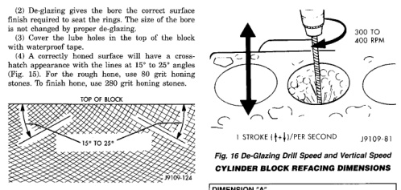
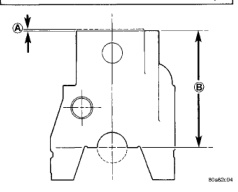

# 9-16 5.9L 24-VALVE TURBO DIESEL ENGINE — BR

## SERVICE PROCEDURES (Continued)

(2) De-glazing gives the bore the correct surface finish required to seat the rings. The size of the bore is not changed by de-glazing.

(3) Cover the lube holes in the top of the block with waterproof tape.

(4) A correctly honed surface will have a crosshatch appearance with the lines at 15° to 25° angles (Fig. 15). For the rough hone, use 80 grit honing stones. To finish hone, use 280 grit honing stones.

*Fig. 16 Cylinder Bore Crosshatch Pattern]*
- TOP OF BLOCK
- 15° TO 25°

(5) Use a drill, a fine grit Flex-hone and a mixture of equal parts of mineral spirits and SAE 30W engine oil to de-glaze the bores.

(6) The crosshatch angle is a function of drill speed and how fast the hone is moved vertically (Fig. 16).

(7) Vertical strokes MUST be smooth continuous passes along the full length of the bore (Fig. 16).

(8) Inspect the bore after 10 strokes.

(9) Use a strong solution of hot water and laundry detergent to clean the bores. Clean the cylinder bores immediately after de-glazing.

(10) Rinse the bores until the detergent is removed and blow the block dry with compressed air.

(11) Check the bore cleanliness by wiping with a white, lint free, lightly oiled cloth. If grit residue is still present, repeat the cleaning process until all residue is removed. Wash the bores and the complete block assembly with solvent and dry with compressed air.

(12) Be sure to remove the tape covering the lube holes after the cleaning process is complete.

## CYLINDER BLOCK REFACING

(1) The combustion deck can be refaced twice. The first reface should be 0.25 mm (0.0098 inch). If additional refacing is required, an additional 0.25 mm (0.0098 inch) can be removed. Total allowed refacing is 0.50 mm (0.0197 inch) - (Fig. 17).

(2) The upper right corner of the rear face of the block must be stamped with a X when the block is refaced to 0.25 mm (0.0098 inch). A second X must be stamped beside the first when the block is refaced to 0.50 mm (0.0197 inch) - (Fig. 18).

*Fig. 17 De-Glazing Drill Speed and Vertical Speed]*
- 300 TO 400 RPM
- 1 STROKE (+)/PER SECOND

### CYLINDER BLOCK REFACING DIMENSIONS

**DIMENSION "A"**

| | Dimension |
|---|---|
| 1st Reface | 0.25mm (0.0098 in.) |
| 2nd Reface | 0.25mm (0.0098 in.) |
| Dim (A) Total | 0.50 mm (0.0197 in.) |

**DIMENSION "B"**

| | Dimension |
|---|---|
| Dim. "B" (STD.) | 323.00 mm ± 0.10 mm (12.7165 in. ± 0.0039 in.) |
| 1st Reface | 322.75 mm ± 0.10 mm (12.7067 in. ± 0.0039 in.) |
| 2nd Reface | 322.50 mm ± 0.10 mm (12.6968 in. ± 0.0039 in.) |

[Figure: Fig. 17 Refacing Dimensions of the Cylinder Block]
- A
- B

(3) Consult the parts catalog for the proper head gaskets which must be used with refaced blocks to ensure proper piston-to-valve clearance.