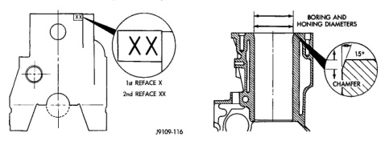
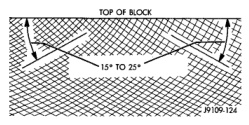

# BR 5.9L 24-VALVE TURBO DIESEL ENGINE 9-17

## SERVICE PROCEDURES (Continued)

*Fig. 19 Stamp Block after Rebore - Shows cylinder block with XX markings and reference points for 1st and 2nd reface]*

*Fig. 20 Boring and Honing Diameters - Cross-section showing boring diameter dimensions with detail callout*

### CYLINDER BORE REPAIR

Cylinder bore(s) can be repaired by one of two methods:
- Method 1—Over boring and using oversize pistons and rings.
- Method 2—Boring and installing a repair sleeve to return the bore to standard dimensions.

#### METHOD 1—OVERSIZE BORE

Oversize pistons and rings are available in two sizes - 0.50 mm (0.0197 inch) and 1.00 mm (0.0393 inch).

Any combination of standard, 0.50 mm (0.0197 inch) or 1.00 mm (0.0393 inch) overbore may be used in the same engine.

If more than 1.00 mm (0.0393 inch) overbore is needed, a repair sleeve can be installed (refer to Method 2—Repair Sleeve).

Cylinder block bores may be bored twice before use of a repair sleeve is required (Fig. 19). The first bore is 0.50 mm (0.0197 inch) oversize. The second bore is 1.00 mm (0.0393 inch) oversize.

After boring to size, use a honing stone to chamfer the edge of the bore (Fig. 19).

A correctly honed surface will have a crosshatch appearance with the lines at 15° to 25° angles with the top of the cylinder block (Fig. 20). For the rough hone, use 80 grit honing stones. To finish hone, use 280 grit honing stones.

A maximum of 1.2 micrometer (48 microinch) surface finish must be obtained.

After finish honing is complete, immediately clean the cylinder bores with a strong solution of laundry detergent and hot water.

After rinsing, blow the block dry.

Check the bore cleanliness by wiping with a white, lint-free, lightly oiled cloth. There should be no grit residue present.

If the block is not to be used right away, coat it with a rust-preventing compound.

**BORING DIAMETER DIMENSION**

| Rebore | Dimension (mm/inch) |
|--------|--------------------|
| 1st REBORE | 102.469 mm (4.0342 inch) |
| 2nd REBORE | 102.969 mm (4.0539 inch) |

**HONING DIAMETER DIMENSIONS**

| Bore Type | Dimension (mm/inch) |
|-----------|--------------------|
| STANDARD | 102.020 ± 0.020 mm (4.0165 ± 0.0008 inch) |
| 1st REBORE | 102.520 ± 0.020 mm (4.0362 ± 0.0008 inch) |
| 2nd REBORE | 103.020 ± 0.020 mm (4.0559 ± 0.0008 inch) |

**CHAMFER DIMENSIONS**

Approx. 1.25 mm (0.049 inch) by 15°

J9109-119

[Figure: Fig. 19 Cylinder Bore Dimensions - Shows cross-section with 1st to 2nd measurement]

J9109-124

[Figure: Fig. 20 Crosshatch Pattern of Repaired Sleeve(s) - Shows crosshatch pattern]

#### METHOD 2—REPAIR SLEEVE

If more than a 1.00 mm (0.03937 inch) diameter oversize bore is required, the block must be bored and a repair sleeve installed.

Bore the block cylinder bore to 104.500-104.515 mm (4.1142-4.1148 inch) - (Fig. 21).