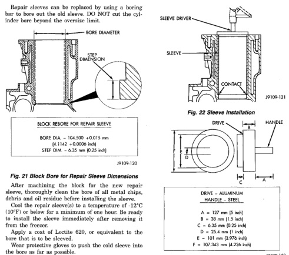

# 9-18 5.9L 24-VALVE TURBO DIESEL ENGINE BR

## SERVICE PROCEDURES (Continued)

Repair sleeves can be replaced by using a boring bar to bore the old sleeves. DO NOT cut the cylinder bore threads for oversize.

*Fig. 22 Bore Diameter - Cross-section showing bore diameter and step dimension with detail callout*

**BLOCK REBORE FOR REPAIR SLEEVE**

| Dimension | Measurement (mm/inch) |
|-----------|-----------------------|
| BORE DIA. | 104.500-104.515 mm (4.1142 ± 0.0006 inch) |
| STEP DIM. | 6.35 mm (0.25 inch) |

J9109-120

[Figure: Fig. 21 Block Bore for Repair Sleeve Dimensions]

After machining the block for the new repair sleeve, thoroughly clean the bore of all metal chips, debris and oil residue before installing the sleeve.

Cool the repair sleeve(s) to a temperature of -12°C (10°F) or below for a minimum of one hour. Be ready to install the sleeve immediately after removing it from the freezer.

Apply a coat of Loctite 620, or equivalent to the bore that is to be sleeved.

Wear protective gloves to push the cold sleeve into the bore as far as possible.

Using a sleeve driver, drive the sleeve downward until it contacts the step at the bottom of the bore (Fig. 22).

A sleeve driver can be constructed as follows (Fig. 23).

Set up a boring bar and machine the sleeve to 101.956 mm (4.014 inch) - (Fig. 24).

After removing the boring bar, use a honing stone to chamfer the corner of the repair sleeve(s) - (Fig. 24).

A correctly honed surface will have a crosshatch appearance with the lines at 15° to 25° angles with the top of the cylinder block. For the rough hone, use 80 grit honing stones. To finish hone, use 280 grit honing stones.

Finished bore inside dimension is 102.020 ± 0.020 mm (4.0165 ± 0.0008 inch).

A maximum of 1.2 micrometer (48 microinch) surface finish must be obtained.

[Figure: Fig. 22 Sleeve Installation - Cross-section showing sleeve driver and sleeve with contact point]

J9109-121

[Figure: Fig. 23 Sleeve Driver Construction - Technical drawing showing:
- A = 127 mm (5 inch)
- B = 30 mm (1.25 inch)
- C = 6.35 mm (0.25 inch)
- D = 25.4 mm (1 inch)
- E = 101 mm (3.976 inch)
- F = 102.943 mm (4.226 inch)
- DRIVE = ALUMINUM
- HANDLE = STEEL]

J9109-122

After finish honing is complete, immediately clean the cylinder bores with a strong solution of laundry detergent and hot water.

After rinsing, blow the block dry with compressed air.

Wipe the bore with a white, lint-free, lightly oiled cloth. Make sure there is no grit residue present.

Apply a rust-preventing compound if the block will not be used immediately.

A standard diameter piston and a piston ring set must be used with a sleeved cylinder bore.

### CAM BORE REPAIR

The front cam bushing bore can be bored to 59.235 Mm ± 0.013 mm (2.332 inch ± 0.0006 inch) oversize. DO NOT bore the intermediate or rear cam bore to