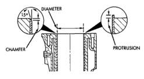
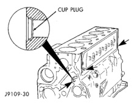
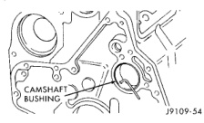

# BR AUTOMATIC 5.9L 24-VALVE TURBO DIESEL ENGINE 9-19

## SERVICE PROCEDURES (Continued)

*Fig. 25 Sleeve Machining Dimensions - Technical diagram showing sleeve diameter, chamfer, and protrusion measurements]*

**SLEEVE DIAMETER:** 101.956 mm (4.014 inch)

**SLEEVE PROTRUSION:**
- MIN. - FLUSH WITH BLOCK
- MAX. - 0.050 mm (0.0019 inch)

**SLEEVE CHAMFER:**
- APPROX. 1.25 mm (0.049 inch) BY 15°

the front cam bore oversize dimensions. Intermediate and rear cam bores may be bored to 57.235 mm ±0.013 mm (2.253 inch ±0.0005-inch) oversize. A surface finish of 2.3 micrometers (92 micro-inch) must be maintained. Not more than 20% of an area of any one bore may be 3.2 micrometers (126 micro-inch).

Camshaft bores can be repaired individually. It is not necessary to repair undamaged cam bores in order to repair individually damaged cam bores. The standard front bushing cannot be used to repair intermediate or rear bores.

Install all cam bushings flush or below the front cam bore surface. The oil hole must align to allow a 3.2 mm (0.125 inch) rod to pass through freely (Fig. 25).

*Fig. 26 Oil Hole Alignment - Diagram showing camshaft bushings alignment]*

### CYLINDER BLOCK CUP PLUG REPLACEMENT

(1) Remove the cup plugs from the oil passages (Fig. 26).

(2) Apply a bead of Loctite 277 around the outside diameter of the oil passage cup plugs.

(3) Drive the cup plugs in until they bottom in the bore (Fig. 26).

(4) Fill the engine with oil. Run the engine and check for leaks.

(5) Stop the engine and check the oil level with the dipstick.

*Fig. 27 Cup Plug Locations in Cylinder Block - Diagram showing cup plug positions]*

### PISTON GRADING PROCEDURE

• When rebuilding an engine with the original cylinder block, crankshaft and pistons, make sure the pistons are installed in their original cylinder.

• If replacing the piston(s), make sure the replacement piston(s) are the same grade as the one being replaced.

• If a new cylinder block and/or crankshaft is used, the piston grading procedure MUST be performed to determine the proper piston grade for each cylinder.

(1) Install any of the original connecting rod and piston assemblies into the No.1 cylinder. DO NOT install the piston rings.

(2) Install the upper bearing shell in the connecting rod with the tang of the bearing in the slot of the connecting rod. The connecting rod bearing shell must be installed in the original connecting rod and cap. Use clean lubricating oil to coat the inside diameter of the connecting rod bearing shell.

(3) Install the bearing shell in the connecting rod cap with the tang of the bearing in the slot to the cap. Use clean lubricating oil to coat the inside diameter of the bearing shell.

(4) The four digit number stamped on the connecting rod and cap at the parting line must match and be installed on the oil cooler side of the engine. Install the connecting rod cap and capscrews. Tighten the capscrews to 35 N·m (26 ft. lbs.) torque.

(5) Use a fine grit stone to remove any burrs from the cylinder block head deck. Zero the dial indicator to the cylinder block head deck.