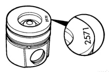

# 9-20 5.9L 24-VALVE TURBO DIESEL ENGINE BR

## SERVICE PROCEDURES (Continued)

(6) Move the dial indicator directly over the piston pin to eliminate any side-to-side movement.

(7) Rotate the crankshaft to top dead center (TDC). Rotate the crankshaft clockwise and counterclockwise to find the highest dial indicator reading. Record the reading.

(8) Remove the piston and connecting rod assembly from the No.1 cylinder and install the assembly into the No.2 cylinder. Repeat the procedure for every cylinder using the same piston and connecting rod assembly.

(9) Determine the grade of the piston being used by referring to the Piston Protrusion Chart below. Four digits on top of the piston can be cross referenced to a Chrysler part number for replacement (Fig. 27). If the number on the piston cannot be seen, measure from the top of the piston to the top of the piston pin to see what grade piston is used (Fig. 28).

*Fig. 27 Piston Grading Number Location - Diagram showing location of grading numbers on piston top]*

**NOTE:** Use the table below when piston grading numbers are missing or not legible.

### CONNECTING ROD BEARING AND CRANKSHAFT JOURNAL CLEARANCE

Measure the connecting rod bore with the bearings installed and the bolts tightened to 100 N·m (73 ft. lbs.) torque.

Record the smaller diameter.

Measure the diameter of the rod journal at the location shown (Fig. 29). Calculate the average diameter for each side of the journal.

The clearance is the difference between the connecting rod bore (smallest diameter) and the average diameter for each side of the crankshaft journal.

If the crankshaft is within limits, replace the bearing. If the crankshaft is out of limits, grind the crankshaft to the next smaller size and use oversize rod bearings.

### PISTON PROTRUSION CHART

| IF MEASURING PISTON IS GRADING #: | AND PROTRUSION IS: | USE GRADE: |
|---|---|---|
| 3708 | 0.609-0.711 mm (0.024-0.028 in.) | A |
| 3708 | 0.508-0.609mm (0.020-0.024 in.) | B |
| 3708 | 0.406-0.508 mm (0.016-0.020 in.) | C |
| 3709 | 0.711-0.813 mm (0.028-0.032 in.) | A |
| 3709 | 0.609-0.711 mm (0.024-0.028 in.) | B |
| 3709 | 0.508-0.609 mm (0.020-0.024 in.) | C |
| 3710 | 0.813-0.914 mm (0.032-0.036 in.) | A |
| 3710 | 0.711-0.813 mm (0.028-0.032 in.) | B |
| 3710 | 0.609-0.711 mm (0.024-0.028 in.) | C |

### ALTERNATIVE GRADE IDENTIFICATION METHOD

| DIMENSION "A" | REF. NUMBER | GRADE |
|---|---|---|
| 51.554-51.607 mm (2.029-2.031 in.) | 3708 | A |
| 51.654-51.707 mm (2.033-2.035 in.) | 3709 | B |
| 51.754-51.807 mm (2.037-2.039 in.) | 3710 | C |

### MAIN BEARING CLEARANCE

Inspect the main bearing bores for damage or abnormal wear.

Install the crankshaft main bearings and measure main bearing bore diameter with the main bolts tightened to 176 N·m (130 ft. lbs.) torque (Fig. 30). Measure the diameter of the main journal at the locations shown (Fig. 31). Calculate the average diameter for each side of the journal.

Calculate the main bearing journal to bearing clearance. the clearance specifications are 0.119 mm (0.00475 inch). If the crankshaft journal is within limits, replace the main bearings. If not within spec-