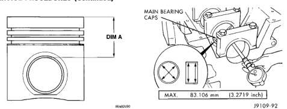
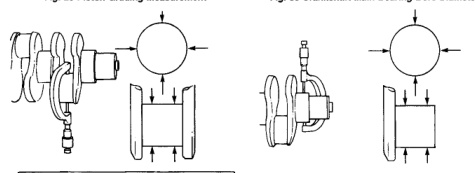

# 5.9L 24-VALVE TURBO DIESEL ENGINE 9-21

## SERVICE PROCEDURES (Continued)

*Fig. 28 Piston Grading Measurement - Shows piston with DIM A measurement indicator]*

*Fig. 30 Crankshaft Main Bearing Bore Diameter - Shows engine block with main bearing caps and measurement points]*
- MAX. 83.106 mm (3.2719 inch)
- J9109-92

[Figure: Fig. 29 Connecting Rod Journal Diameter Limits - Shows crankshaft with measurement specifications]

| Specification | Value |
|---------------|-------|
| MIN. | 68.962 mm (2.715 inch) |
| MAX. | 69.013 mm (2.717 inch) |
| Out-of-Round - Max. | 0.050 mm (0.002 inch) |
| Taper - Max. | 0.013 mm (0.0005 inch) |
| Bearing Clearance - Max. | 0.089 mm (0.0035 inch) |

J9109-91

[Figure: Fig. 31 Crankshaft Main Journal Diameter - Shows crankshaft with measurement points]

| Specification | Value |
|---------------|-------|
| MIN. | 82.962 mm (3.2662 inch) |
| MAX. | 83.103 mm (3.2682 inch) |

J9109-93

mm (0.0394 inch). The thrust surface is located on the No.6 main bearing. When the thrust surface requires grinding, the main journal must be ground to the same undersize dimension.

**CAUTION:** Welding of the crankshaft is not allowed. Failure of the crankshaft will result.

### MAIN JOURNAL

All main journals are to be ground in the opposite direction of engine rotation (clockwise as viewed from the front of crankshaft). Polish the journals in the same direction as engine rotation.

The main bearing grinding specifications are shown in (Fig. 32).

### CRANKSHAFT SERVICE

Crankshaft main and rod journals may be ground in increments of 0.25 mm (0.0098 inch) up to a total of 1.00 mm (0.0394 inch).

The only exception is the main journal thrust width surface. This journal must be ground in increments of 0.50 mm (0.0197 inch) up to a total of 1.00