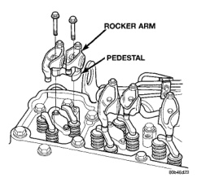
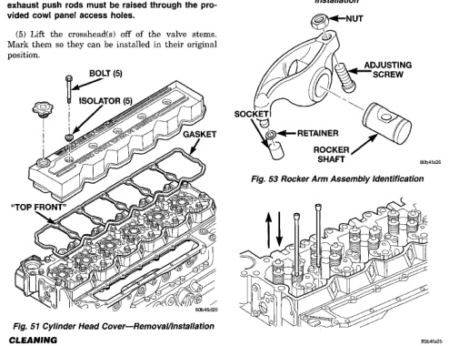

**BR** ────────────────────────────────── **5.9L 24-VALVE TURBO DIESEL ENGINE 9-29**

# REMOVAL AND INSTALLATION (Continued)

## ROCKER ARMS, CROSSHEADS, AND PUSH RODS

### REMOVAL

(1) Disconnect the battery negative cables.

(2) Remove cylinder head cover (Fig. 51). Refer to procedure in this group.

(3) Remove the rocker arm/pedestal fasteners (Fig. 52) and remove rocker arm and pedestal from cylinder head. Mark the arms and pedestals so they can be installed in their original position.

**CAUTION: When removing the rocker arms, the sockets (Fig. 53) may come loose and fall into the engine. Make sure they stay with the arm upon removal/installation.**

(4) Lift the push rod(s) up and out of the engine (Fig. 54). Mark them so they can be installed in their original position.

**NOTE: The #5 cyl. exhaust and #6 cyl. intake and exhaust push rods must be raised through the provided cowl panel access holes.**

(5) Lift the crosshead(s) off of the valve stems. Mark them so they can be installed in their original position.

*Fig. 51 Cylinder Head Cover—Removal/Installation]*
- BOLT (8)
- ISOLATOR (8)
- GASKET
- *TOP FRONT

*Fig. 52 Rocker Arms and Pedestals—Removal/Installation]*
- ROCKER ARM
- PEDESTAL

[Figure: Fig. 53 Rocker Arm Assembly Identification]
- NUT
- ADJUSTING SCREW
- SOCKET
- RETAINER
- ROCKER SHAFT

[Figure: Fig. 54 Push Rod Removal/Installation]

### CLEANING

Clean all components in a suitable solvent. If necessary, use a wire brush or wheel to remove stubborn