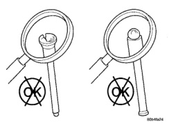
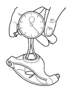
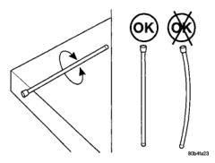
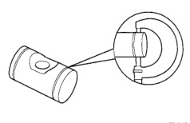

**9-30 5.9L 24-VALVE TURBO DIESEL ENGINE** ────────────────────────────────── **BR**

# REMOVAL AND INSTALLATION (Continued)

deposits. Rinse in hot water and blow dry with compressed air. Inspect oil passages in rocker arms and pedestals. Apply compressed air to lubrication orifices to purge contaminants.

### INSPECTION

#### Rocker Arms

(1) Remove rocker shaft and inspect for cracks and excessive wear in the bore or shaft. Remove socket and inspect ball insert and socket for signs of wear. Replace retainer if necessary.

Measure the rocker arm bore and shaft (Fig. 55)(Fig. 56).

*Fig. 55 Measuring Rocker Arm Bore]*

**ROCKER ARM BORE (MAX.)**
22.027 mm (.867 in.)

*Fig. 56 Measuring Rocker Arm Shaft]*

**ROCKER ARM SHAFT (MIN.)**
21.965 mm (.865 in.)

#### Push Rods

Inspect the push rod ball and socket for signs of scoring. Check for cracks where the ball and the socket are pressed into the tube (Fig. 57).

Roll the push rod on a flat work surface with the socket end hanging off the edge (Fig. 58). Replace any push rod that appears to be bent.

*Fig. 57 Inspecting Push Rod for Cracks]*
- OK symbol
- X symbol (reject)

*Fig. 58 Inspecting Push Rod for Flatness]*
- OK symbol
- X symbol (reject)

#### Crossheads

Inspect the crossheads for cracks and/or excessive wear on rocker lever and valve tip mating surfaces (Fig. 59).

### INSTALLATION

(1) If previously removed, install the push rods in their original location (Fig. 54). Verify that they are seated in the tappets.

(2) Lubricate the valve tips and install the crossheads in their original locations.

(3) Lubricate the crossheads and push rod sockets and install the rocker arms and pedestals (Fig. 52) in their original locations. Tighten bolts to 36 N·m (27 ft. lbs.) torque.