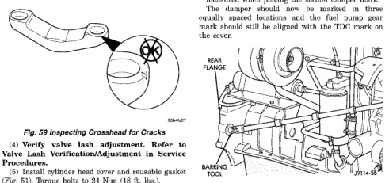

## 5.9L 24-VALVE TURBO DIESEL ENGINE 9-31

### REMOVAL AND INSTALLATION (Continued)

*Fig. 51 Inspecting Crosshead for Cracks]*
- REAR FLANGE
- MAGNET

(4) Verify valve lash adjustment. Refer to Valve Lash Verification/Adjustment in Service Procedures.

(5) Install cylinder head cover and reusable gasket (Fig. 61). Torque bolts to 24 N·m (18 ft. lbs.).

(6) Connect battery negative cables.

#### VALVE SPRINGS AND SEALS (IN VEHICLE)

**REMOVAL**

(1) Disconnect the battery negative cables.

(2) Remove the cylinder head cover (Fig. 61).

(3) Remove the rocker arms and crossheads (Fig. 62) from the cylinder(s) to be serviced. Mark each component so they can be installed in their original position.

(4) Remove the fuel pump gear access cover (Fig. 64).

(5) Using the crankshaft barring tool #7471B (Fig. 60), rotate the engine to line up the mark on the pump gear with the TDC mark on the cover. At this engine position, cylinders #1 and #6 can be serviced.

(6) Remove the accessory drive belt. Refer to Group 7, Cooling for the correct procedure.

(7) With the fuel injection pump gear mark aligned at TDC, add a paint mark anywhere on the gear housing cover next to the crankshaft damper. Place another mark on the vibration damper in alignment with the mark you just made on the cover.

(8) Divide the crankshaft damper into three equally sized segments as follows:

(a) Using a tape measure, measure the circumference of the crankshaft damper and divide the measurement by three (3).

(b) Measure that distance in a counter-clockwise direction from the first balancer mark and place another mark on the balancer.

(c) From the second damper mark, again measure in a counter-clockwise direction and place a mark on the damper at the same distance you measured when placing the second damper mark. The damper should now be marked in three equally spaced locations and the fuel pump gear mark should still be aligned with the TDC mark on the cover.

[Figure: Fig. 60 Rotating Engine with Barring Tool]
- REAR FLANGE
- TOOL

(9) Compress the valve springs at cyls. #1 and #6 as follows:

(a) Remove the injector clamp (Fig. 63) from the cylinder(s) to be serviced. Do not remove the bolt shown in (Fig. 63).

(b) Install the valve spring compressor mounting base as shown in (Fig. 65). Reinstall the injector clamp bolt finger tight.

(c) Install the top plate, washer, and nut. Using a suitable wrench tighten the nut (clock-wise) (Fig. 66) to compress the valve springs and remove the collets.

(d) Rotate the compressor nut counter-clockwise to relieve tension on springs. Remove spring compressor.

(e) Remove and replace retainers, springs, and seals as necessary.

(f) Do not rotate the engine until the springs and retainers are re-installed.

(g) Install seals, springs and retainers. Install spring compressor, compress valve springs and install the collets.

(h) Release the spring tension and remove the compressor. Verify that the collets are seated by tapping on the valve stem with a plastic hammer.

(10) Using the crankshaft barring tool, rotate the engine clockwise until the next crankshaft damper paint mark aligns with the mark you placed on the cover. In this position, cylinders #2 and #5 can be serviced.

(11) Repeat the valve spring compressing procedure previously performed and service the retainers, springs, and seals as necessary.