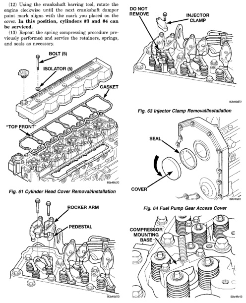

## 9-32 5.9L 24-VALVE TURBO DIESEL ENGINE

### REMOVAL AND INSTALLATION (Continued)

(12) Using the crankshaft barring tool, rotate the engine clockwise until the next crankshaft damper paint mark aligns with the mark you placed on the cover. In this position, cylinders #3 and #4 can be serviced.

(13) Repeat the spring compressing procedure previously performed and service the retainers, springs, and seals as necessary.

*Fig. 61 Cylinder Head Cover Removal/Installation]*
- BOLT (5)
- ISOLATOR (5)
- GASKET
- *TOP FRONT

[Figure: Fig. 62 Rocker Arm and Crosshead Removal/Installation]
- ROCKER ARM
- PEDESTAL

[Figure: Fig. 63 Injector Clamp Removal/Installation]
- DO NOT REMOVE
- INJECTOR CLAMP

[Figure: Fig. 64 Fuel Pump Gear Access Cover]
- SEAL
- COVER

[Figure: Fig. 65 Spring Compressor Mounting Base—Part of Tool 8319]
- COMPRESSOR MOUNTING BASE