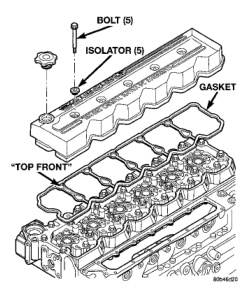
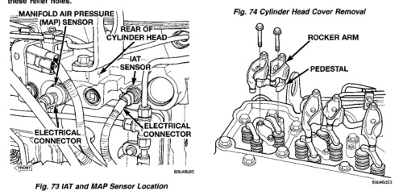

## REMOVAL AND INSTALLATION (Continued)

(f) Loosen the #3, 5, and 6 cylinder high pressure lines at the cylinder head.

(g) Remove the #3, 5, and 6 cylinder high pressure line bundle from the engine.

(25) Remove the lift pump-to-fuel filter low pressure line.

(26) Remove the fuel filter-to-injection pump low pressure line.

(27) Disconnect the water-in-fuel and fuel heater connectors.

(28) Remove the fuel filter assy-to-manifold cover bolts and remove filter assy from vehicle.

(29) Disconnect the Intake Air Temperature and Manifold Air Pressure sensor connectors (Fig. 73).

(30) Remove the cylinder head cover (Fig. 74). Refer to procedure in this group.

(31) Remove the rocker levers (Fig. 75), cross heads and push rods (Fig. 76). Mark each component so they can be installed in their original positions.

**NOTE: The #5 cylinder exhaust and the #6 cylinder intake and exhaust pushrods are removed by lifting them up and through the provided cowl panel access holes. Remove the rubber plugs to expose these relief holes.**

*Fig. 73 IAT and MAP Sensor Location]*
- MANIFOLD AIR PRESSURE SENSOR
- REAR OF CYLINDER HEAD
- IAT SENSOR
- ELECTRICAL CONNECTOR
- ELECTRICAL CONNECTOR

*Fig. 74 Cylinder Head Cover Removal]*
- BOLT (5)
- ISOLATOR (15)
- GASKET
- TOP FRONT

[Figure: Fig. 75 Rocker Arms and Pedestal Removal]
- ROCKER ARM
- PEDESTAL

(32) Remove the fuel return line banjo bolt at the rear of the cylinder head (Fig. 77). Be careful not to drop the two (2) sealing washers.

(33) Reinstall the engine lift bracket at the rear of cylinder head.

(34) Remove twenty six (26) cylinder head-to-block bolts.

(35) Attach an engine lift crane to engine lift brackets and lift cylinder head off engine and out of vehicle.

(36) Remove the head gasket and inspect for failure.

### CLEANING

Clean the cylinder head and cylinder block mating surfaces with an ordinary scraper. Remove all excess gasket material and carbon. Use a quality wire brush on stubborn areas. Inspect head bolt holes for damage and remove any foreign material.