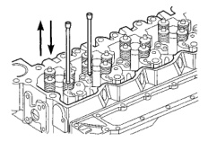
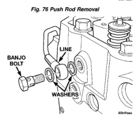
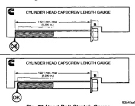

## REMOVAL AND INSTALLATION (Continued)

*Fig. 76 Push Rod Removal]*

*Fig. 78 Fuel Drain Fitting at Rear of Head]*
- BANJO BOLT
- LINE
- WASHER

Clean the cylinder head bolts with a wire brush or a soft wire wheel. Remove deposits from the shank and threads.

Remove any excess coolant, oil, or foreign material from the top of the pistons and inside the piston bowls.

### INSPECTION

#### CHECKING FOR CRACKS

Inspect the cylinder head for cracks in the combustion surface. Pressure test any cylinder head that is visibly cracked. A cylinder head that is cracked between the injector bore and valve seat can be pressure tested and re-used if o.k.; however, if the crack extends into the valve seat, the valve seat must be replaced.

#### SURFACE CONDITION

Visually inspect the cylinder block and head combustion surfaces for localized dips or imperfections. Check the cylinder head and block combustion surfaces for overall out-of-flatness. If either the visual or manual inspection exceeds the limits, then the head or block must be surfaced.

| CYLINDER HEAD FLATNESS (MAX) | |
|---|---|
| End to End | 0.305 mm (0.012 in.) |
| Side to Side | 0.076 mm (0.003 in.) |

| CYLINDER BLOCK FLATNESS (MAX) | |
|---|---|
| End to End | 0.075 mm (0.003 in.) |
| Side to Side | 0.075 mm (0.003 in.) |

#### HEAD BOLT INSPECTION

Visually inspect the cylinder head bolts for damaged threads, corroded/pitted surfaces, or a reduced diameter due to bolt stretching.

If the bolts are not damaged, their "free length" should be measured using the capscrew stretch gauge provided with the replacement head gasket. Place the head of the bolt against the base of the slot and align the bolt with the straight edge of gauge (Fig. 78). If the end of the bolt touches the foot of the gauge, the bolt must be discarded. The maximum bolt free length is 132.1 mm (5.200 in.).

*Fig. 79 Head Bolt Stretch Gauge]*
- CYLINDER HEAD CAPSCREW LENGTH GAUGE
- Max Free Length 132.1 mm (5.200 in.)

### INSTALLATION

**WARNING: THE OUTSIDE EDGE OF THE HEAD GASKET IS VERY SHARP. WHEN HANDLING THE NEW HEAD GASKET, USE CARE NOT TO INJURE YOURSELF.**

(1) Install a new gasket with the part number side up, and locate the gasket over the dowel sleeves.

(2) Using an engine lifting crane, lower the cylinder head onto the engine.

(3) Lightly lubricate head bolts with engine oil and install. Using the sequence shown in (Fig. 79), torque bolts in the following three (3) steps: