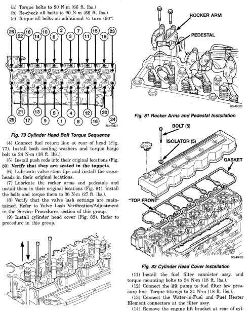

# REMOVAL AND INSTALLATION (Continued)

(a) Torque bolts to 90 N·m (66 ft. lbs.)
(b) Re-check all bolts to 90 N·m (66 ft. lbs.)
(c) Torque all bolts an additional ¼ turn (90°)

*Fig. 80 Cylinder Head Bolt Torque Sequence - Diagram showing numbered bolt positions 1-20 in sequence order on cylinder head]*

(7) Install the fuel line at rear of head (Fig. 77). Install both sealing rings and torque banjo bolt to 24 N·m (18 ft. lbs.).

(8) Install push rods into their original locations (Fig. 80). Verify that they are seated in the tappets.

(9) Lubricate valve stem tips and install the crossheads in their original locations.

(10) Install the rocker arms and pedestals and install them in their original locations (Fig. 81). Install the bolts and torque them to 36 N·m (27 ft. lbs.).

(9) Verify that the valve lash settings are maintained. Refer to Valve Lash Verification/Adjustment in this group for the correct procedure.

(9) Install cylinder head cover (Fig. 82). Refer to procedure in this group.

[Figure: Fig. 80 Push Rod Installation - Diagram showing push rods being installed into cylinder head]

(10) Connect the IAT and MAP sensor connectors.

[Figure: Fig. 81 Rocker Arms and Pedestal Installation - Diagram showing rocker arm and pedestal assembly with labeled components:
• ROCKER ARM
• PEDESTAL]

[Figure: Fig. 82 Cylinder Head Cover Installation - Exploded view diagram showing:
• BOLT (3)
• ISOLATOR (5)
• GASKET
• *TOP FRONT*]

(11) Install the fuel filter cannister assy. and torque mounting bolts to 24 N·m (18 ft. lbs.).

(12) Connect the lift pump to fuel filter low pressure line. Torque fittings to 24 N·m (18 ft. lbs.).

(13) Connect the Water-in-Fuel and Fuel Heater Element connectors at the filter assy.

(14) Remove the engine lift bracket at rear of cylinder head.

(15) Install the high pressure fuel lines (Fig. 71)(Fig. 72) as follows: