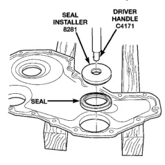

# 5.9L 24-VALVE TURBO DIESEL ENGINE 9-43
## REMOVAL AND INSTALLATION (Continued)

*Fig. 97 Installing Seal Into Cover With Tool 8281*

*Fig. 98 Installing Front Cover with Seal Pilot]*

(6) Install the cover bolts and tighten to 24 N·m (18 ft. lbs.) torque. Remove pilot tool.

(7) Install the vibration damper (Fig. 98) and torque the bolts to 125 N·m (92 ft. lbs.). Use the engine barring tool to keep the engine from rotating during tightening operation.

(8) Install the fan support/hub assembly (Fig. 97)and torque bolts to 24 N·m (18 ft. lbs.).

(9) Install the accessory drive belt. Refer to Group 7, Cooling for the correct procedure.

(10) Connect battery negative cables.

(11) Start engine and check for oil leaks.

### GEAR HOUSING COVER

#### REMOVAL

(1) Disconnect both battery negative cables.

(2) Raise vehicle on hoist.

(3) Partially drain engine coolant into container suitable for re-use.

(4) Lower vehicle.

(5) Remove radiator upper hose.

(6) Disconnect coolant recovery bottle hose from radiator filler neck and lift bottle off of fan shroud.

(7) Disconnect windshield washer pump supply hose and electrical connections and lift washer bottle off of fan shroud.

(8) Remove the fan shroud-to-radiator mounting bolts.

(9) Remove viscous fan/drive assembly. The fan drive nut has left handed threads. Refer to Group 7, Cooling System for the correct procedure.

(10) Remove cooling fan shroud and fan assy. from the vehicle.

(11) Remove the accessory drive belt. Refer to Group 7, Cooling for the correct procedure.

(12) Remove the cooling fan support/hub from the front of the engine (Fig. 102).

(13) Raise the vehicle on hoist.

(14) Remove the crankshaft damper (Fig. 103).

(15) Lower the vehicle.

(16) Remove the gear cover-to-housing bolts and gently pry the cover away from the housing, taking care not to mar the gasket surfaces.

[Figure: Fig. 102 Fan Support/Hub Assembly—Removal/Installation
- FAN SUPPORT/HUB
- FAN PULLEY]

#### CLEANING

Clean cover and housing gasket mating surfaces. Use a suitable scraper and be careful not to damage the gear housing surface, since it is aluminum. Thoroughly clean the front seal area of the crankshaft.