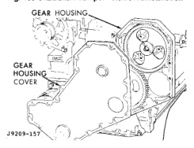

# 9-44 5.9L 24-VALVE TURBO DIESEL ENGINE BR
## REMOVAL AND INSTALLATION (Continued)

*Fig. 103 Crankshaft Damper—Removal/Installation*

*Fig. 104 Gear Housing and Cover]*

The seal lip and the sealing surface on the crankshaft must be free from all oil residue to prevent seal leaks.

#### INSPECTION

Inspect the gear housing and cover for cracks and replace if necessary. Carefully straighten any bends or imperfections in the gear cover with a ball-peen hammer on a flat surface. Inspect the crankshaft front seal and journal for imperfections and replace seal if necessary. Refer to procedure in this group.

#### INSTALLATION

(1) Obtain a seal pilot/installation tool from a crankshaft front seal service kit and install the pilot into the seal.

(2) Apply a bead of Mopar® Silicone Rubber Adhesive Sealant or equivalent to the gear housing cover. Be sure to surround all through holes.

[Figure: Fig. 105 Installing Cover with Seal Pilot
- SEAL PILOT]

(3) Using the seal pilot to align the cover (Fig. 105), install the cover to the housing and install the bolts. Tighten the bolts to 24 N·m (18 ft. lbs.) torque.

(4) Remove the seal pilot.

(5) Raise the vehicle.

(6) Install the crankshaft damper (Fig. 103) and tighten bolts to 125 N·m (92 ft. lbs.) torque.

(7) Lower vehicle.

(8) Install the fan support/hub assy. (Fig. 102)and tighten bolts to 24 N·m (18 ft. lbs.) torque.

(9) Install the accessory drive belt. Refer to Group 7, Cooling System for the correct procedure.

(10) Install the cooling fan and shroud together. Start fan nut and fan shroud-to-radiator bolts by hand.

(11) Torque fan drive nut to 57 N·m (42 ft. lbs.) torque.

(12) Torque fan shroud-to-radiator bolts to 11 N·m (95 in. lbs.) torque.

(13) Install the windshield washer reservoir to the fan shroud and connect the washer pump supply hose and electrical connection.

(14) Install the coolant recovery bottle to the fan shroud and connect the hose to the radiator filler neck.

(15) Install the radiator upper hose and clamps.

(16) Add coolant.

(17) Connect the battery cables.

(18) Start engine and inspect for leaks.

### GEAR HOUSING

#### REMOVAL

(1) Disconnect the battery negative cables.

(2) Raise vehicle on hoist.

(3) Remove the oil pan and suction tube. Refer to procedure in this group.

(4) Partially drain engine coolant into container suitable for re-use.