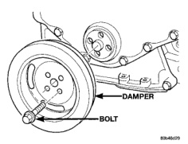
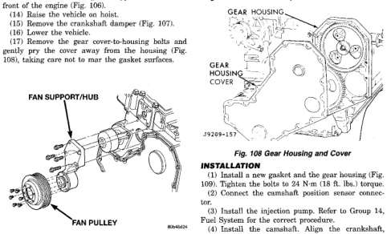

# 5.9L 24-VALVE TURBO DIESEL ENGINE 9-45

## REMOVAL AND INSTALLATION (Continued)

(5) Lower vehicle.

(6) Remove radiator upper hose.

(7) Disconnect coolant recovery bottle hose from radiator filler neck and lift bottle off of fan shroud.

(8) Disconnect windshield washer pump supply hose and electrical connections and lift washer bottle off of fan shroud.

(9) Remove the fan shroud-to-radiator mounting bolts.

(10) Remove viscous fan/drive assembly. The fan drive nut has left handed threads. Refer to Group 7, Cooling System for the correct procedure.

(11) Remove cooling fan shroud and fan assy. from the vehicle.

(12) Remove the accessory drive belt. Refer to Group 7, Cooling for the correct procedure.

(13) Remove the cooling fan support/hub from the front of the engine (Fig. 106).

(14) Raise the vehicle on hoist.

(15) Remove the crankshaft damper (Fig. 107).

(16) Lower the vehicle.

(17) Remove the gear cover-to-housing bolts and gently pry the cover away from the housing (Fig. 108), taking care not to mar the gasket surfaces.

*Fig. 106 Fan Support/Hub Assembly—Removal/Installation]*
- FAN SUPPORT/HUB
- FAN PULLEY

(18) Remove the fuel injection pump. Refer to Group 14, Fuels Systems for the correct procedure.

(19) Disconnect the camshaft position sensor connector.

(20) Raise the tappets and remove the camshaft. Refer to procedure in this group.

(21) Remove the gear housing and gasket (Fig. 109).

(22) Clean the gasket material from the cylinder block.

*Fig. 107 Crankshaft Damper—Removal/Installation]*
- DAMPER
- BOLT

[Figure: Fig. 108 Gear Housing and Cover]
- GEAR HOUSING COVER
- GEAR HOUSING

### INSTALLATION

(1) Install a new gasket and the gear housing (Fig. 109). Tighten the bolts to 24 N·m (18 ft. lbs.) torque.

(2) Connect the camshaft position sensor connector.

(3) Install the injection pump. Refer to Group 14, Fuel System for the correct procedure.

(4) Install the camshaft. Align the crankshaft, camshaft, and injection pump gear marks as shown in (Fig. 110).

(5) If a new housing is installed, the camshaft position sensor must be transferred to the new housing.

(6) Obtain a seal pilot/installation tool from a crankshaft front seal service kit and install the pilot into the crankshaft front oil seal.

(7) Apply a bead of Mopar® Silicone Rubber Adhesive Sealant or equivalent to the gear housing cover. Be sure to surround all through holes.

(8) Using the seal pilot to align the cover (Fig. 111), install the cover to the housing and install the bolts. Tighten the bolts to 24 N·m (18 ft. lbs.) torque.