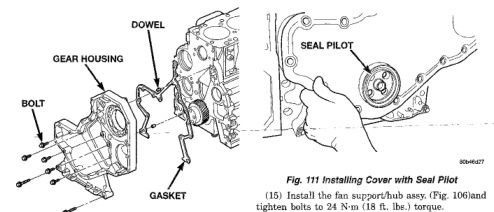

# 9-46 5.9L 24-VALVE TURBO DIESEL ENGINE

## REMOVAL AND INSTALLATION (Continued)

*Fig. 109 Gear Housing and Gasket]*
- GEAR HOUSING
- BOLT
- DOWEL
- GASKET

[Figure: Fig. 110 Camshaft/Crankshaft Gear Alignment]

(9) Remove the seal pilot.

(10) Raise the vehicle.

(11) Trim any excess gear housing gasket to make it flush with the oil pan rail.

(12) Using a new gasket, install the oil pan and suction tube. Refer to procedure in this group.

(13) Install the crankshaft damper (Fig. 107) and tighten bolts to 125 N·m (92 ft. lbs.) torque.

(14) Lower vehicle.

[Figure: Fig. 111 Installing Cover with Seal Pilot]
- SEAL PILOT

(15) Install the fan support/hub assy. (Fig. 106) and tighten bolts to 24 N·m (18 ft. lbs.) torque. Refer to Group 7, Cooling System for the correct procedure.

(16) Install the cooling fan and shroud together. Start fan nut and fan shroud-to-radiator bolts by hand.

(17) Torque fan drive nut to 57 N·m (42 ft. lbs.) torque.

(18) Torque fan shroud-to-radiator bolts to 11 N·m (95 in. lbs.) torque.

(19) Install the windshield washer reservoir to the fan shroud and connect the washer pump supply hose and electrical connection.

(20) Install the coolant recovery bottle to the fan shroud and connect the hose to the radiator filler neck.

(21) Install the radiator upper hose and clamps.

(22) Add engine oil.

(23) Add coolant.

(24) Connect the battery cables.

(25) Start engine and inspect for leaks.

## CAMSHAFT

**NOTE: This procedure requires use of the Cummins Tappet Replacement Tool Kit #3822513.**

### REMOVAL

(1) Disconnect both battery negative cables.

(2) Recover A/C refrigerant (if A/C equipped). Refer to Group 24, Heating and Air Conditioning for the correct procedure.

(3) Raise vehicle on hoist.

(4) Drain engine coolant into container suitable for re-use.

(5) Lower vehicle.