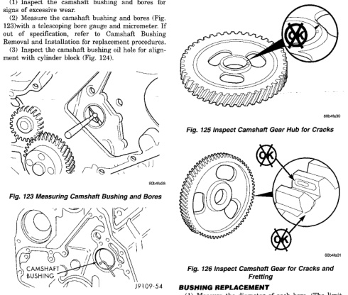

# 9-50 5.9L 24-VALVE TURBO DIESEL ENGINE
## REMOVAL AND INSTALLATION (Continued)

(1) Inspect the camshaft bushing and bores for signs of excessive wear.

(2) Measure the camshaft bushing and bores (Fig. 123) with a telescoping bore gauge and micrometer. If out of specification, refer to Camshaft Bushing Removal and Installation for replacement procedures.

(3) Inspect the camshaft bushing oil hole for alignment with cylinder block (Fig. 124).

*Fig. 123 Measuring Camshaft Bushing and Bores - Shows camshaft assembly with measurement points]*

[Figure: Fig. 124 Inspecting Oil Hole Alignment - Shows camshaft with oil hole alignment check]

**Camshaft Gear**

Inspect the camshaft gear for cracks (gear and hub) (Fig. 125), and chipped/broken/fretted teeth (Fig. 126). If replacement is necessary, refer to Camshaft Gear Removal and Installation in this group.

**Thrust Plate**

Inspect the camshaft thrust plate for excessive wear in the camshaft contact area. Measure thrust plate thickness using the following chart. Replace any thrust plate that falls outside of these specifications.

**CAMSHAFT THRUST PLATE THICKNESS**

9.34 mm (0.368 in.) MIN.

9.58 mm (0.377 in.) MAX.

[Figure: Fig. 125 Inspect Camshaft Gear Hub for Cracks - Shows camshaft gear with crack inspection points marked with X]

[Figure: Fig. 126 Inspect Camshaft Gear for Cracks and Fretting - Shows camshaft gear with multiple inspection points marked with X]

### BUSHING REPLACEMENT

(1) Measure the diameter of each bore. (The limit for the bushing in the No.1 bore is the same as for the other bores without bushings). The limit of the inside diameter is 54.133 mm (2.1312 inch). If the camshaft bore for the first cam bushing is worn beyond the limit, install a new service bushing. Inspect the rest of the camshaft bores for damage or excessive wear.

(2) If the bores without a bushing are worn beyond the limit, the engine must be removed for machining and installation of service bushings. If badly worn, replace the cylinder block.

(3) Remove the bushing from the No.1 bore, using a universal cam bushing tool.

(4) Mark the cylinder block so you can align the oil hole in the cylinder block with the oil hole in the bushing.

Apply a coating of Loctite® 609 to the backside of the new bushing. Avoid getting Loctite® in the oil hole.