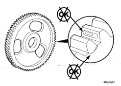
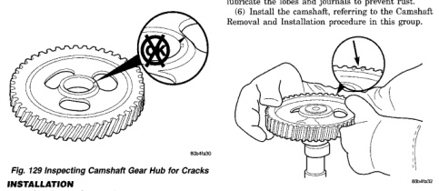

# 9-52 5.9L 24-VALVE TURBO DIESEL ENGINE BR

## REMOVAL AND INSTALLATION (Continued)

(30) Add engine coolant.

(31) Connect the battery negative cables.

(32) Start engine and check for engine oil and coolant leaks.

(33) Charge A/C system with refrigerant (if A/C equipped). Refer to Group 24, Heating and Air Conditioning for the correct procedure.

### CAMSHAFT GEAR (CAMSHAFT REMOVED)

**CAUTION: DO NOT use an oxygen/acetylene torch to heat the gear upon removal from the camshaft. This will weaken the gear-to-hub joint and result in gear failure.**

#### REMOVAL

(1) Remove camshaft. Refer to Camshaft Removal and Installation in this group.

(2) Support gear hub and press the camshaft out of the gear.

(3) Remove all burrs and smooth any rough surfaces caused by removing the gear.

#### INSPECTION

Visually inspect the camshaft gear for cracks (hub and gear), chipped or broken teeth, or excessive fretting (Fig. 129)(Fig. 130). Inspect and replace the keyway, if damaged.

*Fig. 129 Inspecting Camshaft Gear Hub for Cracks]*

*Fig. 130 Inspecting Camshaft Gear for Cracks and Fretting]*

(3) Heat the gear in an oven at 177°C (350°F) for 45 minutes.

**WARNING: WEAR PROTECTIVE GLOVES (Fig. 131) TO HANDLE THE HOT GEAR.**

(4) Install the gear with the timing marks visible (Fig. 131). Be sure the gear is seated against the camshaft shoulder (Fig. 132).

(5) If the camshaft is not to be used immediately, lubricate the lobes and journals to prevent rust.

(6) Install the camshaft, referring to the Camshaft Removal and Installation procedure in this group.

[Figure: Fig. 131 Installing Camshaft Gear]

#### INSTALLATION

(1) If replacing the camshaft, make sure the keyway is transferred to the new camshaft.

(2) Lubricate the camshaft surface with Lubriplate 105, or equivalent.

**CAUTION: The camshaft gear will be permanently distorted if overheated. The oven temperature should never exceed 177°C (350°F).**

### TAPPETS

**NOTE: This procedure requires use of the Cummins Tappet Replacement Tool Kit #3822513.**

(1) Raise tappets and remove camshaft. Refer to Camshaft Removal and Installation procedure in this group.