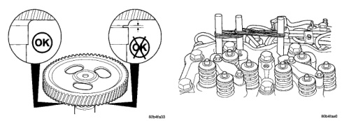
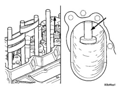
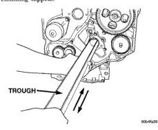

# 5.9L 24-VALVE TURBO DIESEL ENGINE 9-53

## REMOVAL AND INSTALLATION (Continued)

*Fig. 133 Verify Correct Gear Installation - Shows two circular gears marked OK and X with timing marks]*

*Fig. 134 Secure Dowel/Tappet to Adjacent Cylinder - Shows engine block with dowel rods securing tappets]*

(2) Insert the trough (provided with tool kit) the full length of the camshaft bore (Fig. 133). Make sure the cap end goes in first and the open side faces up (towards lifters).

(3) Remove only one tappet at a time. Remove rubber band from one cylinder pair and attach tappet dowel not being removed to the next cylinder pair (Fig. 134).

(4) Raise dowel rod (disengage from tappet) and allow tappet to fall into trough (Fig. 135).

(5) Carefully remove trough (do not rotate) and tappet. If the tappet is not being replaced, mark it so it can be installed in its original location.

(6) Re-install trough and repeat procedure on remaining tappets.

*Fig. 135 Lift Dowel Rod to Disengage from Tappet - Shows hand lifting dowel rod with trough labeled]*

[Figure: Fig. 133 Inserting the Trough - Shows trough being inserted into engine block]

### CLEANING

Clean tappet with a suitable solvent. Rinse in hot water and blow dry with a clean shop rag or compressed air.

### INSPECTION

(1) Visually inspect the tappet the tappet socket, stem, and face for excessive wear, cracks, or obvious damage (Fig. 136).

(2) Measure the tappet stem diameter. Replace the tappet if it falls below the minimum size (Fig. 136).

### INSTALLATION

(1) Insert the trough the full length of the camshaft bore (Fig. 133). Again, make sure the cap end goes in first and the open side faces up (towards lifters).

(2) Lower the tappet installation tool through the push rod hole (Fig. 137) and into the trough.

(3) Retrieve the tappet installation tool using the hooked rod provided with the tool kit (Fig. 138).

(4) Lubricate the tappet with clean engine oil or suitable equivalent and install the tappet to the installation tool (Fig. 139).

(5) Pull the tappet up and into position (Fig. 139). If difficulty is experienced getting the tappet to make