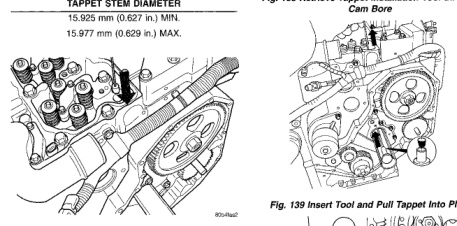
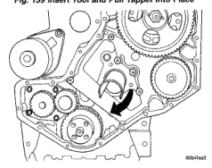
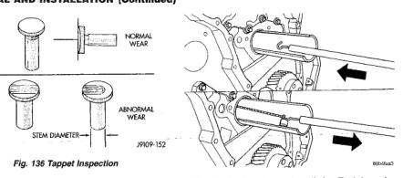

# 9-54 5.9L 24-VALVE TURBO DIESEL ENGINE

## REMOVAL AND INSTALLATION (Continued)

*Fig. 136 Tappet Inspection - Shows tappet with normal wear and abnormal wear indicators, stem diameter measurement location]*

**TAPPET STEM DIAMETER**

| Specification | Measurement |
|--------------|-------------|
| Minimum | 15.925 mm (0.627 in) MIN. |
| Maximum | 15.977 mm (0.629 in) MAX. |

*Fig. 138 Retrieve Tappet Installation Tool through Cam Bore - Shows tool being retrieved through engine block]*

*Fig. 140 Insert Installation Tool through Push Rod Hole - Shows installation tool being inserted through push rod hole]*

the turn into the tappet bore, wiggle the trough while gently pulling up on the tappet.

(6) With the tappet in place, rotate the trough one half turn so the open side is down (toward crankshaft) (Fig. 140).

(7) Remove the tappet installation tool from the tappet.

(8) Re-install a dowel rod and secure the rod with a rubber band.

(9) Rotate the trough one half turn and repeat the procedure for the remaining tappets.

(10) Install the camshaft and previously removed components. Refer to Camshaft Removal and Installation in this group.

[Figure: Fig. 139 Insert Tool and Pull Tappet Into Place - Shows tappet installation tool pulling tappet into position]

[Figure: Fig. 140 Rotate Trough One Half Turn (180°) - Shows trough rotated in engine block]