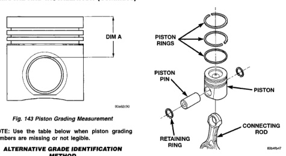
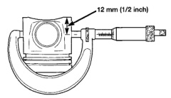

# REMOVAL AND INSTALLATION (Continued)

*Fig. 144 Piston Grading Measurement]*
- DIM A

*Fig. 151 Piston and Connecting Rod Assembly]*
- PISTON RINGS
- PISTON PIN
- PISTON
- CONNECTING ROD
- RETAINING RING

NOTE: Use the table below when piston grading numbers are missing or not legible.

## ALTERNATE GRADE IDENTIFICATION METHOD

| DIMENSION "A" | REF. NUMBER | GRADE |
|---|---|---|
| 51.554-51.607 mm (2.029-2.031 in.) | 3708 | A |
| 51.654-51.707 mm (2.033-2.035 in.) | 3709 | B |
| 51.754-51.807 mm (2.037-2.039 in.) | 3710 | C |

## DISASSEMBLY

(1) Remove the retaining rings from the piston (Fig. 144).
(2) Slide the piston pin out of the bore. Heating the connecting rod is not required.
(3) Remove the piston rings (Fig. 151).

## CLEANING

### Pistons

Clean the pistons and pins in a suitable solvent, rinse in hot water and blow dry with compressed air. Soaking the pistons over night will loosen most of the carbon build up. De-carbon the ring grooves with a broken piston ring and again clean the pistons in solvent. Rinse in hot water and blow dry with compressed air.

### Connecting Rods

Clean the connecting rods in a suitable solvent, rinse in hot water and blow dry with compressed air.

## INSPECTION

### Pistons

Inspect the pistons for damage and excessive wear. Check top of the piston, ring grooves, skirt and pin bore. Measure the piston skirt diameter (Fig. 145). If the piston is out of limits, replace the piston.

Uses new piston rings to measure the ring side clearance (Fig. 146). Refer to the illustration and chart for specifications.

[Figure: Fig. 145 Piston Skirt Diameter]
- 12 mm (1/2 inch)

### PISTON SKIRT DIAMETER (MIN.)

101.864 mm (4.0104 in.)