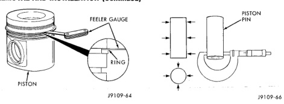
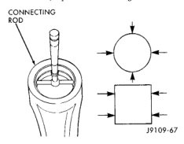

# REMOVAL AND INSTALLATION (Continued)

*Fig. 146 Intermediate and Oil Ring Clearances]*
- FEELER GAUGE
- PISTON
- RING

*Fig. 147 Piston Pin Diameter]*
- PISTON PIN

## RING SIDE CLEARANCE

| RING | MIN | MAX |
|---|---|---|
| TOP KEYSTONE | 0.075 mm (0.003 in.) | 0.150 mm (0.006 in.) |
| INTERMEDIATE | 0.045 mm (0.0018 in.) | 0.095 mm (0.0037 in.) |
| OIL CONTROL | 0.040 mm (0.0016 in.) | 0.085 mm (0.0033 in.) |

Measure the pin bore (Fig. 147). The maximum diameter is 40.025 mm (1.5758 inch). If the bore is over limits, replace the piston.

Inspect the piston pin for nicks, gouges and excessive wear. Measure the pin diameter (Fig. 148). The minimum diameter is 39.990 mm (1.5744 inch). If the diameter is out of limits, replace the pin.

[Figure: Fig. 147 Piston Pin Bore]
- PISTON
- PIN BORE

### Connecting Rods

Inspect the connecting rod for damage and wear. The I-Beam section of the connecting rod cannot have dents or other damage. Damage to this part can cause stress risers which will progress to breakage.

Measure the connecting rod pin bore (Fig. 149). The maximum diameter is 40.042 mm (1.5764 inch). If out of limits, replace the connecting rod.

[Figure: Fig. 149 Connecting Rod Pin Bore]
- CONNECTING ROD

## ASSEMBLY

NOTE: The piston is symmetrical and can be installed to the connecting rod in either direction. It is good practice to re-install the piston in the same orientation as it was removed.

(1) Position the rod into the piston, orienting the mark you made on removal and the numbers on the rod and cap the same way (Fig. 150). Install the retaining ring into the pin groove on the one side of the piston.
(2) Lubricate the pin and bore with engine oil.
(3) Install the piston pin in the opposite side of the installed retaining pin. Pistons and rods do not