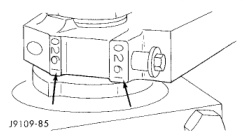

# 5.9L 24-VALVE TURBO DIESEL ENGINE 9-61

## REMOVAL AND INSTALLATION (Continued)

*Fig. 162 Correct Rod Cap Installation]*

(9) Tighten the bolts to 70 N·m (51 ft. lbs.) torque.
(10) Tighten the bolts to 100 N·m (73 ft. lbs.) torque.
(11) The crankshaft must rotate freely. Check for freedom of rotation as the caps are installed. If the crankshaft does not rotate freely, check the installation of the rod bearings and the bearing size.
(12) Install the vibration damper using the connecting rod and the crankshaft (Fig. 161). DO NOT measure the clearance between the cap and crankshaft.

[Figure: Fig. 161 Side Clearance Connecting Rod/Crankshaft]

**SIDE CLEARANCE LIMITS**

| | MIN. | MAX. |
|---|---|---|
| | 0.100 mm (0.004 inch) | 0.300 mm (0.012 inch) |

(13) Install the suction tube and oil pan. Refer to Procedure in this Group.
(14) Install the cylinder head onto the engine. Refer to Procedure in this group.
(15) Install a new filter and fill the crankcase with new engine oil.
(16) Connect the battery negative cables and start engine.

## CRANKSHAFT OIL SEAL—REAR

### REMOVAL

(1) Disconnect the battery negative cables.
(2) Remove the transmission and transfer case (if equipped). Refer to Group 21, Transmission and Transfer Case for the correct procedures.
(3) Remove the clutch cover and disc (if manual trans equipped).
(4) Remove the flywheel or converter drive plate.
(5) Drill holes 180° apart into the seal. Be careful not to get the drill against the crankshaft.
(6) Install #10 sheet metal screws in the drilled holes and remove the rear seal with a slide hammer (Fig. 162).

[Figure: Fig. 162 Crankshaft Rear Seal Removal
- NO. 10 SCREW
- REAR SEAL
- CRANKSHAFT
- SLIDE HAMMER]

### CLEANING

Clean the crankshaft sealing surface with solvent and dry with a clean shop towel or compressed air. Wipe the inside bore of the crankshaft seal retainer with a clean shop towel.

### INSPECTION

Inspect the crankshaft journal for gouges, nicks, or other imperfections. If the seal groove in the crankshaft is excessively deep, install the new seal 1/8" deeper into the retainer bore, or obtain a crankshaft wear sleeve that is available in the aftermarket.

### INSTALLATION

**CAUTION:** The seal lip and the sealing surface on the crankshaft must be free from all oil residue to prevent seal leaks. The crankshaft and seal must be completely dry when the seal is installed.

(1) Install the seal pilot, provided in the replacement kit, onto the crankshaft.
(2) Using the provided alignment/installation tool, start the seal over the pilot and into the retainer by hand.
(3) Using a ball peen hammer, strike the tool at the 12, 3, 6, and 9 o'clock positions until the alignment tool bottoms out on the retainer (Fig. 163).
(4) Remove the seal pilot.