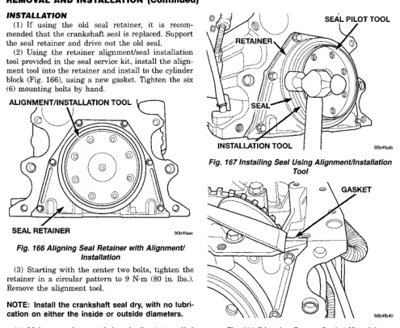

# 5.9L 24-VALVE TURBO DIESEL ENGINE 9-63

## REMOVAL AND INSTALLATION (Continued)

### INSTALLATION

(1) If using the old seal retainer, it is recommended that the crankshaft rear seal be used to support the old retainer and drive out the old seal.

(2) If using the new seal but not mentioned installation tool provided in the seal service kit, install the alignment tool into the cylinder end and install to the cylinder block (Fig. 166), using a new gasket. Tighten the six (6) mounting bolts by hand.

*Fig. 167 Aligning Seal Retainer with Alignment/Installation Tool]*
- ALIGNMENT/INSTALLATION TOOL
- SEAL RETAINER

(3) Starting with the center two bolts, tighten the retainer in a circular pattern to 9 N·m (80 in. lbs.). Remove the alignment tool.

**NOTE: Install the crankshaft seal dry, with no lubrication on either the inside or outside diameters.**

(4) Make sure the provided seal pilot is installed into the new crankshaft seal. Use the alignment/installation tool and press the seal onto the crankshaft (Fig. 167). Alternately drive the seal at the 12, 3, 6 and 9 o'clock positions.

[Figure: Fig. 167 Installing Seal Using Alignment/Installation Tool]
- SEAL PILOT TOOL
- RETAINER
- SEAL
- INSTALLATION TOOL

(5) Remove the alignment tool and trim the retainer gasket even with the oil pan mounting surface (Fig. 168).

[Figure: Fig. 168 Trimming Excess Gasket Material]
- GASKET

(6) Remove the seal pilot.

(7) Apply a small amount of Mopar® Silicone Rubber Adhesive Sealant to the oil pan rail T-joints.

(8) Install the oil pan, suction tube and gaskets. Tighten the suction tube fasteners to 24 N·m (18 ft. lbs.). Tighten the oil pan mounting bolts, starting from the center and working outward, to 24 N·m (18 ft. lbs.) torque.

(9) Install the flywheel housing and bolts. Tighten the bolts to 60 N·m (44 ft. lbs.) torque.

(10) Connect the starter motor wires.

(11) Install the flywheel or converter drive plate. Tighten bolts to 137 N·m (101 ft. lbs.)

(12) Install the transmission and transfer case (if equipped). Refer to Group 21, Transmission and Transfer Case for the correct procedures.

(13) Lower vehicle.

(14) Fill the crankcase with new engine oil.

(15) Connect the battery negative cables.

(16) Start engine and check for oil leaks.

### CRANKSHAFT

#### REMOVAL

(1) Remove engine from vehicle and place on a stand. Refer to procedure in this group.

(2) Remove oil pan and suction tube. Refer to procedure in this group.

(3) Remove the crankshaft rear seal retainer. Refer to procedure in this group.

(4) Remove the front gear housing. Refer to procedure in this group.

(5) The main bearing caps should be numbered. If they are not, be sure to mark them, beginning with