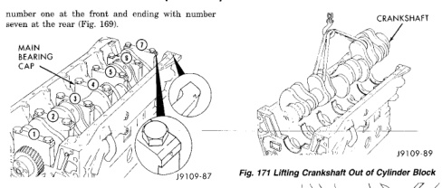
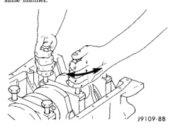
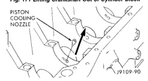

# 9-64 5.9L 24-VALVE TURBO DIESEL ENGINE

## REMOVAL AND INSTALLATION (Continued)

number one at the front and ending with number seven at the rear (Fig. 169).

*Fig. 170 Numbering Main Bearing Caps]*
- MAIN BEARING CAP

**CAUTION: DO NOT pry on the main caps to free them from the cylinder block.**

(6) Use two of the main bearing cap bolts to wiggle the main cap loose (Fig. 170), being careful not to damage the bolt threads. Remove all caps in the same manner.

*Fig. 171 Main Bearing Cap Removal]*

**WARNING: USE A HOIST TO AVOID INJURY.**

(7) Lift the crankshaft and gear from the cylinder block (Fig. 171).

*Fig. 172 Lifting Crankshaft Out of Cylinder Block]*
- CRANKSHAFT

(8) Remove the main bearings from the block and the main caps.

(9) Remove the piston cooling nozzles by using a 3/16 inch pin punch to push them out (Fig. 172).

[Figure: Fig. 172 Piston Cooling Nozzles]
- PISTON COOLING NOZZLE

#### CLEANING

Clean the crankshaft oil galley holes with a nylon brush.

Rinse in clean solvent and dry with compressed air.

#### INSPECTION

Inspect the rod and main journal for deep scores, signs of overheating and other abnormal marks. Inspect the front and rear seal contact areas of the crankshaft for scratches or grooving.

The service seal kit will position the seal slightly deeper into the seal bore so it will contact the crankshaft at a different location. If this has already been done and the crankshaft has two worn areas, install a wear sleeve to provide a new contact surface for the seal.

(1) Visually inspect the tone wheel for missing teeth, cracks, and out-of-round.

**NOTE: For additional crankshaft procedures, refer to "Crankshaft Service" in the Service Procedures section of this group.**

#### INSTALLATION

**CAUTION: Use only hand force to push the nozzle in place. If driven with a hammer, the nozzle will be damaged.**