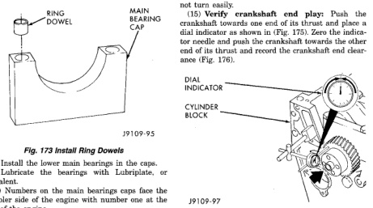

## REMOVAL AND INSTALLATION (Continued)

(1) Use a center punch to push the piston cooling nozzle into place. Install nozzles so they are flush with or slightly below the saddle surface.

(2) Make sure the saddle surface is clean and dry. Install the upper main bearings.

(3) Install the combination thrust/main bearing in the number six main bearing location.

(4) Lubricate the bearings with Lubriplate 105, or equivalent.

**WARNING: TO AVOID INJURY, USE A HOIST TO INSTALL THE CRANKSHAFT.**

(5) If replacing the crankshaft, transfer the tone wheel to the new crankshaft.

(a) Install the large section of the tone wheel.

(b) Coat the bolts with Mopar® Lock 'N Seal or Loctite® 242, install and torque to 8 N·m (71 in. lbs.) torque.

(c) Rotate the crankshaft and install the small section of the tone wheel.

(d) Coat the bolts with Mopar® Lock 'N Seal or Loctite® 242, install and torque to 8 N·m (71 in. lbs.) torque.

(6) Install the crankshaft.

**CAUTION: Crankshaft must be lowered onto the bearings straight to prevent damage to thrust bearings.**

(7) Install the ring dowels in the main bearing caps (Fig. 173).

*Fig. 173 Install Ring Dowels - Diagram showing ring dowels installation in main bearing cap with labels for:*

(8) Install the lower main bearings in the caps.

(9) Lubricate the bearings with Lubriplate, or equivalent.

(10) Numbers on the main bearings caps face the oil cooler side of the engine with number one at the front of the engine.

(11) Place the caps in their respective positions.

(12) Lubricate the main bearing bolt threads and underside of the bolt head with clean engine oil.

(13) Tighten the bolts in the sequence shown in (Fig. 174) using the following steps:

- STEP 1—Torque all bolts in sequence to 60 N·m (44 ft. lbs.) torque.
- STEP 2—Torque all bolts in sequence to 119 N·m (88 ft. lbs.) torque.
- STEP 3—Torque all bolts in sequence to 176 N·m (129 ft. lbs.) torque.

*Fig. 174 Crankshaft Main Bearing Bolt Torque Sequence - Diagram showing numbered bolt sequence pattern on crankshaft]*

(14) Turn the crankshaft to determine that it will rotate freely all 360°. Check the main bearing cap installations and/or the bearing sizes if the shaft does not turn easily.

(15) Verify crankshaft end play: Push the crankshaft towards one end of its thrust and place a dial indicator as shown in (Fig. 175). Zero the indicator needle and push the crankshaft towards the other end of its thrust and record the crankshaft end clearance (Fig. 176).

[Figure: Fig. 175 Measuring Crankshaft End Play - Diagram showing dial indicator placement on cylinder block to measure crankshaft end play]