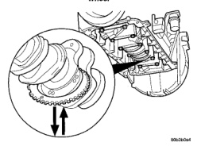

## REMOVAL AND INSTALLATION (Continued)

*Fig. 177 Crankshaft End Clearance - Diagram showing measurement points for crankshaft end clearance with labels for:*

*Fig. 178 Removing/Installing Small Section of Tone Wheel - Diagram showing small section of tone wheel removal/installation]*

### CRANKSHAFT END PLAY SPECIFICATIONS

| Specification | Measurement |
|--------------|-------------|
| MIN | 0.100 mm (0.004 in.) |
| MAX | 0.430 mm (0.017 in.) |

(16) Install the front gear housing. Refer to procedure in this group.

(17) Install the crankshaft rear oil seal retainer. Refer to procedure in this group.

(18) Install the oil pan and suction tube. Refer to procedure in this group.

(19) Install engine into vehicle. Refer to procedure in this group.

### CRANKSHAFT TONE WHEEL

#### REMOVAL

(1) Disconnect the battery negative cables.

(2) Remove the oil pan and suction tube. Refer to procedure in this group.

(3) Using the crankshaft barring tool #7471B, rotate the crankshaft so the small section of the ring is facing away from the engine.

(4) Remove the #6 main bearing cap.

(5) Remove the two bolts fastening the small section of the wheel to the crankshaft. Remove the small section (Fig. 177).

(6) Using the barring tool, rotate the crankshaft and remove the three bolts from the large section of the tone wheel.

(7) Rotate the large section of the ring off of the crankshaft (Fig. 178). The crankshaft might have to be rotated to allow clearance for removal.

#### CLEANING

Clean the tone wheel with a suitable solvent. Rinse with hot water and blow dry with compressed air. Make sure the mounting surface of the wheel and crankshaft are free of all debris.

[Figure: Fig. 178 Removing/Installing Large Section of Tone Wheel - Diagram showing large section of tone wheel removal/installation]

#### INSPECTION

Inspect the tone wheel for missing teeth, cracks, or a damaged mounting surface (Fig. 179). Place the wheel on a known flat surface and verify that it is not out of flat. Replace the tone wheel if any of these conditions are found.

#### INSTALLATION

(1) Install the large section of the tone wheel.

(2) Coat the bolts with Mopar® Lock 'N Seal or Loctite® 242, install and torque to 8 N·m (71 in. lbs.) torque.

(3) Rotate the crankshaft and install the small section of the tone wheel.

(4) Coat the bolts with Mopar® Lock 'N Seal or Loctite® 242, install and torque to 8 N·m (71 in. lbs.) torque.

(5) Install the #6 main bearing cap. Install the bolts and torque in three steps: