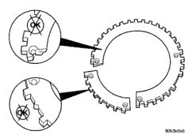
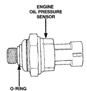
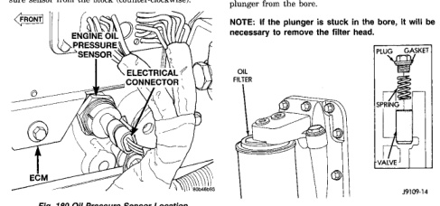

# 5.9L 24-VALVE TURBO DIESEL ENGINE 9 - 67

## REMOVAL AND INSTALLATION (Continued)

*Fig. 180 Inspecting Tone Wheel for Damage]*
- Shows two circular diagrams with inspection points marked

Step 1—Preliminary ............ 60 N·m (44 ft. lbs.)
Step 2—Secondary ............ 119 N·m (88 ft. lbs.)
Step 3—Final ................. 176 N·m (129 ft. lbs.)

(6) Using a new gasket, install the oil pan and suction tube. Refer to procedure in this group.
(7) Add engine oil.
(8) Connect the battery negative cables and start engine.

### OIL PRESSURE SENSOR

**REMOVAL**

(1) Disconnect the battery negative cables.
(2) Disconnect the oil pressure sensor connector (Fig. 180).
(3) Using a suitable socket, remove the oil pressure sensor from the block (counter-clockwise).

*Fig. 181 Oil Pressure Sensor Location]*
- FRONT
- ENGINE OIL PRESSURE SENSOR
- ELECTRICAL CONNECTOR
- ECM

**INSTALLATION**

(1) If the sensor is not being replaced, inspect the o-ring (Fig. 181) and replace if necessary.
(2) Install the oil pressure sensor and tighten to 16 N·m (144 in. lbs.) torque.
(3) Connect the battery negative cables.
(4) Start engine and check for oil leaks at the sensor.

*Fig. 182 Oil Pressure Sensor and O-Ring]*
- ENGINE OIL PRESSURE SENSOR
- O-RING

### OIL PRESSURE REGULATOR VALVE AND SPRING

**REMOVAL**

(1) Disconnect the battery negative cables.
(2) Remove the threaded plug, spring and plunger (Fig. 182). Insert a finger or a seal pick to lift the plunger from the bore.

**NOTE: If the plunger is stuck in the bore, it will be necessary to remove the filter head.**

[Figure: Fig. 182 Oil Pressure Regulator]
- PLUG
- GASKET
- OIL FILTER
- VALVE