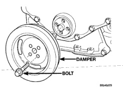

# 9 - 68 5.9L 24-VALVE TURBO DIESEL ENGINE

## REMOVAL AND INSTALLATION (Continued)

**CLEANING**

(1) Clean the regulator spring and plunger with a suitable solvent and blow dry with compressed air. If the plunger bore requires cleaning, it is necessary to remove the oil filter head to avoid getting debris into the engine.

**INSPECTION**

Inspect the plunger and plunger bore for cracks and excessive wear. Polished surfaces are acceptable. Verify that the plunger moves freely in the bore.

Check the spring for height and load limitations (Fig. 183). Replace the spring if out of limits shown in the figure.

Inspect the plug o-ring for cracks or brittleness, and replace as necessary.

*Fig. 183 Oil Pressure Regulator Spring Check]*
- VALVE OPEN: 138 kPa [1.62 psi]
- LOAD: 126 N [28.4 lb]
- FREE LENGTH: 66mm [2.6 inch]

**INSTALLATION**

(1) Install the plunger, spring, and plug as shown in (Fig. 183). Tighten the plug to 80 N·m (60 ft. lbs.) torque.
(2) Connect the battery negative cables.
(3) Start the engine and verify that it has oil pressure.

### OIL PUMP

**REMOVAL**

(1) Disconnect the battery negative cables.
(2) Remove fan/drive assembly.
(3) Remove the accessory drive belt.
(4) Remove the fan support/hub assembly.
(5) Remove crankshaft damper (Fig. 184).
(6) Remove the gear cover-to-housing bolts and gently pry the cover away from the housing, taking care not to mar the gasket surfaces (Fig. 185).
(7) Remove the four mounting bolts and pull the pump from the bore in the cylinder block (Fig. 186).

[Figure: Fig. 184 Crankshaft Damper Removal/Installation]
- DAMPER
- BOLT

[Figure: Fig. 185 Gear Housing and Cover]
- GEAR HOUSING
- GEAR HOUSING COVER

[Figure: Fig. 186 Oil Pump Removal]
- OIL PUMP
- BOLT (4)